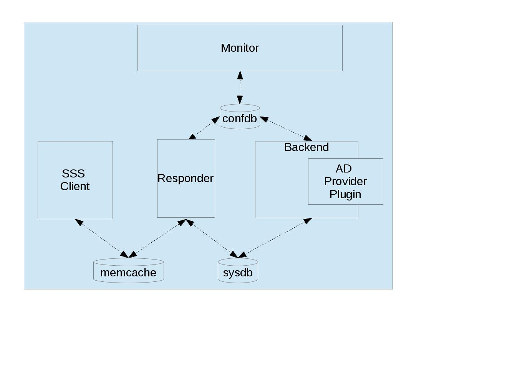

##############
SSSD Internals
##############

************
Introduction
************

The purpose of this document is to give a basic description of the
internals of the SSSD implementation. The material in this document is
*mostly* accurate as of SSSD 2.0. Some parts of the page, such as the sbus
details were not updated to reflect the changes that happened just before
the 2.0 release. It is assumed that the reader is already familiar with
the external usage of SSSD. The intended audience of this document are
new contributors to the SSSD project. This document is not intended to be
comprehensive. For additional details on specific features, please refer
to the various :doc:`list-design-pages`.

This document does not discuss the details of building, installing,
and debugging SSSD. More information on these topics can be found in the
:doc:`./building-sssd` documentation, for example.

To be most useful, this document should be updated as appropriate, and
reviewed at regular intervals.

In order to better understand the material and make things more concrete,
this document starts by describing a specific use case (and configuration)
that will be discussed throughout the document. The document starts
with a high level end-to-end overview, and then deep-dives into detailed
descriptions. The document is organized into the following sections:

 -  Active Directory Use Case: specifies use case used throughout the
    document
 -  System Overview: end-to-end SSSD overview, including short
    descriptions of components
 -  Advanced Topics: offline operation, multiple domains, trust
    relationships
 -  SSSD Wrappers: SBus, SDAP
 -  Common Data Structures: data structures used by each SSSD process
 -  Component Details: gory details of each component
 -  Appendix: tevent, function descriptions, filesystem locations,
    helpful links

Active Directory Use Case
=========================

From an SSSD perspective, there are two main Active Directory (AD) use
cases, depending on whether we are directly integrated with AD, or whether
we are indirectly integrated with AD through IPA. For now, this document
only covers the direct AD integration use case.

SSSD consumes DNS, LDAP, and Kerberos services in order to resolve server
names, perform identity lookups, and perform security-related tasks. In an AD
environment, all three services are typically provided by a single AD server.

In the direct AD integration use case, a host directly joins an AD domain. At
this point, the AD's LDAP service creates a computer account for the host,
and the AD's Kerberos service creates a service principal and shared secret
credentials for the host. After these host credentials are installed in the
host's keytab, the host looks to AD as any other Windows client, allowing us
to leverage existing AD technology. The preceding steps to join a domain,
as well as additional steps that generate appropriate configuration files,
and kick off the master SSSD process (``/usr/sbin/sssd``), can all be performed
by simply running ``realm join foo.com`` as root. For more information on
realmd, see `Realmd Page <http://www.freedesktop.org/software/realmd/>`_.

For our use case, the SSSD configuration file (``/etc/sssd/sssd.conf``)
simply specifies an NSS Responder, a PAM Responder, and a single Backend
that uses an AD Provider Plugin to communicate with an AD server. We
will use the following values for our use case. Throughout the document,
we will mark these values (and derived values) in *emphasis*, to indicate
that other values could have been used.

- the AD domain is named *foo.com*
- the AD server is named *adserver.foo.com*
- the AD username and password we will use in our examples is
  *aduser@foo.com* and *adpass*

Using those values, our use case can be represented by the following
SSSD configuration file:

.. code-block:: ini

    [sssd]                  # information needed by the monitor is specified in [sssd]
    domains = foo.com       # each domain stanza corresponds to a Backend
    services = nss, pam     # each configured service corresponds to a Responder

    [nss]
    default_shell = /bin/bash

    [pam]                   # SSSD should use default values for pam-related options

    [domain/foo.com]        # on this line, foo.com represents a domain stanza
    ad_domain = foo.com     # on this line, foo.com represents an AD domain
    ad_server = adserver.foo.com
    id_provider = ad
    auth_provider = ad
    chpass_provider = ad
    access_provider = ad

Note that one of SSSD's design goals is to allow its configuration file
(``sssd.conf``) to be very short, where configuration values that are
needed (but not provided) are populated by either using default values,
or by using DNS to auto-discover the values.

- if ``ad_domain`` is not specified, it defaults to the value of the
  domain stanza's name (e.g. *foo.com*)
- if ``ad_server`` is not specified, DNS service discovery is used to
  find an appropriate server
- if other providers such as ``auth_provider``, ``chpass_provider``, or ``sudo_provider`` are
  not specified, they default to the value of the ``id_provider`` (e.g.
  ``ad``). The only special-case is the ``access_provider.`` If its value is not specified,
  it defaults to ``permit,`` which means "all users are allowed access". In order to
  make use of access control, the ``access_provider`` must be set explicitly.

For example, if DNS service discovery were available, the domain
configuration above could have equivalently been written as:

.. code-block:: ini

    [domain/foo.com]
    id_provider = ad
    access_provider = ad

System Overview
===============

External Perspective
--------------------

Fundamentally, SSSD provides identity (NSS) and authentication (PAM)
services to its SSS Client Applications using information stored in
remote servers (e.g. AD Server, IPA Server). SSSD serves as a central
point of enforcement and management for the local machine on which it is
running. SSSD components are able to share consistent state because
multiple technologies are configured in a single configuration file.
SSSD also improves performance by maintaining a local SSSD Cache, and by
the fact that SSSD only needs to maintain a single connection to each of
the remote servers (while servicing multiple SSS Client Applications).
SSSD can optionally use the local SSSD Cache to continue to provide
identity and authentication services to users when they go offline.


*This diagram shows two different SSS Client Applications making NSS/PAM
calls to SSSD. In order to fulfill the request, SSSD either uses a
cached result (by consulting the Cache), or an up-to-date result (by
contacting the AD Server using LDAP/KRB). As such, SSSD is acting in a
server role for the SSS Client Applications, and in a client role with
respect to AD.*

**SSS Client Applications**
^^^^^^^^^^^^^^^^^^^^^^^^^^^

Through the beauty of the pluggable NSS and PAM frameworks, an SSS
Client Application (e.g. ``ls``) is unaware that it is communicating with
an SSS Client Library. An SSS Client Application simply calls a standard
NSS or PAM function, which is mapped by the NSS/PAM runtime to a
module-specific function name, and which is then delivered to an SSS
Client Library (assuming that SSSD configuration has taken place). Note
that we can either refer to a Client Library generically (e.g. "SSS
Client Library"), or we can refer to it specifically (e.g. "NSS Client
Library").

Examples of NSS-using SSS Client Applications include ``ls``, ``id``, and
``getent``. These commands call standard NSS functions, which include
settors/gettors for several name databases (e.g. ``passwd,`` ``group,`` ``service,``
``netgroup,`` etc). An entry in a name database can be retrieved by using an
appropriate key (e.g. name, id, port, etc). Alternatively, the entries
in a name database can be enumerated, although this can be quite
inefficient for large databases. The full API supported by the NSS
Client Library is defined in ``src/sss_client/sss_nss.exports``.

Examples of PAM-using SSS Client Applications include ``login``, ``su``, and
``ssh``. These commands call standard PAM functions. However, unlike NSS
functions, PAM functions are called within the context of a PAM
transaction, which maintains the state for the entire transaction
(including any input values set by the caller, such as username, etc). A
typical PAM transaction looks like:

.. code-block:: c

    pam_start("login", "aduser", &pam_conv, &pamh); // initiate pam transaction
    pam_authenticate(pamh, 0);                      // verify identity of user
    ret = pam_acct_mgmt(pamh, 0);                   // determine if user account is valid
    if (ret == PAM_NEW_AUTHTOK_REQD)                // if user password has expired
       pam_chauthtok(pamh, 0);                      // change user password
    pam_setcred(pamh, PAM_ESTABLISH_CRED);          // set user's credentials
    pam_open_session(pamh, 0)                       // initiate session management
    ...                                             // non-pam code
    pam_close_session(pamh, 0)                      // terminate session management
    pam_end(pamh, ret);                             // terminate pam transaction

The PAM conversation function (``pam_conv``), set by the caller, allows
the implementation to communicate directly with the application. For
example, the implementation of PAM functions that use passwords (i.e.
``pam_authenticate``, ``pam_chauthtok``) would use the registered PAM
conversation function to prompt the user for a password.

The full API supported by the PAM Client Library is defined in ``pam_sss.c.``
Note that the PAM Client Library does not handle the ``pam_start()`` and
``pam_end()`` calls that surround a pam transaction, but it handles all
of the PAM functions in between.

Internal Perspective
--------------------

This section gives an internal system overview of SSSD's control flow
(i.e. messages used for control, configuration, initialization) and
SSSD's data flow (i.e. messages related to data traffic resulting from
client requests).

**Control Flow**
^^^^^^^^^^^^^^^^


*This diagram shows SSSD's start-up procedure. The diagram only shows a
single NSS Responder for clarity, but keep in mind that our use case
requires two Responders (NSS and PAM).*

#. Monitor process initializes itself, which includes parsing
   configuration file (``sssd.conf``) and loading it into confdb. After it
   is loaded, the Monitor retrieves and applies Monitor-specific config
   from the confdb.
#. Monitor spawns (i.e. ``fork``/``exec``) a Backend process (``sssd_be``)
   for the single domain specified in config.
#. Backend process initializes itself, which includes sending ``Register``
   message to Monitor, as well as dynamically loading AD Provider
   Plugin.
#. Backend reads confdb in order to retrieve and apply
   Backend-specific config.
#. Monitor spawns an NSS Responder process (shown), as well as a PAM
   Responder (not shown).
#. Responder process initializes itself, which includes sending
   ``RegisterService`` message to Monitor, and sending separate ``Register``
   message to Backend.
#. Responder reads confdb in order to retrieve and apply
   Responder-specific config.

**Data Flow**
^^^^^^^^^^^^^

In this section, we will separately examine the internal data flow for
the NSS Responder and the PAM Responder, since the data flow for the PAM
Responder is more complicated. Note that all of the components in the
Data Flow diagrams are under the SSSD's control, except for the SSS Client
Application and remote AD Server. Also note that this section assumes that
we are in "online mode", meaning that SSSD is able to communicate with
the AD Server. In the "offline mode" case, we are only able to consult
the Cache (since the AD Server is not reachable).

Data Flow (NSS Responder)
"""""""""""""""""""""""""


*This diagram shows the data flow generated by an SSS Client Application
making an NSS request to SSSD.*

#. SSS Client Application's request is handled by our dynamically loaded
   NSS Client Library, which consults the fast cache (aka memcache). If
   valid cache entry exists (unexpired), NSS Client Library immediately
   returns cached result to SSS Client Application.
#. If no valid cache entry exists in fast cache, NSS Client Library
   sends client's NSS request to matching NSS Responder.
#. NSS Responder consults the sysdb cache. If valid cache entry exists
   (unexpired), NSS Responder immediately returns cached result to SSS
   Client Application (this step not shown above)
#. If no valid cache entry exists, NSS Responder sends ``getAccountInfo``
   request message to Backend, asking Backend to update Cache with data
   corresponding to client's NSS request.
#. Backend uses AD Provider Plugin to make LDAP call to remote AD Server
   and to retrieve response from AD Server.
#. Backend updates Cache, and also sends ``getAccountInfo`` response
   message (containing status) to NSS Responder; this also serves as
   indication that Cache has been updated.
#. NSS Responder reads updated result from Cache.
#. NSS Responder returns updated result to NSS Client Library, which
   passes it to SSS Client Application.

Data Flow (PAM Responder)
"""""""""""""""""""""""""


*This diagram shows the data flow generated by an SSS Client Application
making a PAM request to SSSD*

#. SSS Client Application's request is handled by our dynamically loaded
   PAM Client Library, which sends request to matching PAM Responder.
#. Like the NSS Responder, the PAM Responder sends ``getAccountInfo``
   request message to Backend, but only to ask it to update Cache with
   client's group memberships (i.e. initgroups)
#. Backend uses AD Provider Plugin to make LDAP call to remote AD Server
   and to retrieve response.
#. Backend updates Cache, and also sends ``getAccountInfo`` response
   message (containing status) to PAM Responder; this also serves as
   indication that Cache has been updated.
#. PAM Responder reads updated initgroups information from Cache.
#. PAM Responder sends ``pamHandler`` request message to Backend
#. Backend uses AD Provider Plugin to retrieve response from Child
   Process, which makes the actual KRB calls; note that the Child
   Process (not shown) will be discussed later in the document
#. Backend sends ``pamHandler`` response message (containing status) to
   PAM Responder
#. PAM Responder returns updated result to PAM Client Library, which
   passes it to SSS Client Application.

Clearly, the PAM Responder's data flow is different from the NSS
Responder's data flow. The primary difference is that the result of a
``pamHandler`` request is not stored in the Cache. The ``pamHandler``
response message contains status information, most of which is passed
back to the PAM Client Library. Another difference is that the NSS
Responder sends the Backend only a single request message, corresponding
to the SSS Client's request. In contrast, the PAM Responder sends two
request messages: the first one to find the client's group memberships,
and the second one corresponding to the SSS Client's request. There are
a couple of reasons for this. First, the PAM Responder wants to ensure
that the identity returned by LDAP is the same identity that should be
used for authentication. Second, in the case where multiple domains are
configured, the given identity is tried against each domain, in the same
order as it appears in the ``domains`` line in sssd.conf. As soon as the
requested identity has group memberships in a particular domain, that
domain is used as **the** authoritative domain for that client request.
Note that complications arising from the use of subdomains will be
discussed later. Additional difference is that while the PAM responder
always downloads the group memberships from the server (if reachable)
even if the cache is up to date. This is to ensure correct authorization
data on login, because group memberships are set on login on a Linux
system.


SSSD Components
---------------

**Processes and Shared Objects**
^^^^^^^^^^^^^^^^^^^^^^^^^^^^^^^^

Despite the fact that its name suggests there is only a **single**
daemon, the term "SSSD" usually refers to a **set** of daemons and
shared objects that work together to provide identity and authentication
services to SSS Client Applications. The following table summarizes the
SSSD-related processes and shared objects needed for our AD use case
(along with their configuration files). Note that default values are
used for configuration fields that are not specified. A brief
description of these components follows.

+--------------------------------------+----------------------------------------------------------------+
| Component Name                       | Component Configuration                                        |
+======================================+================================================================+
| Shared Object: NSS Client Library    | ``/etc/nsswitch.conf;`` using ``nss_sss.so`` module            |
+--------------------------------------+----------------------------------------------------------------+
| Shared Object: PAM Client Library    | ``/etc/pam.d/system-auth;`` using ``pam_sss.so`` module        |
+--------------------------------------+----------------------------------------------------------------+
| Process: Monitor                     | ``/etc/sssd/sssd.conf:`` ``[sssd]`` stanza                     |
+--------------------------------------+----------------------------------------------------------------+
| Process: NSS Responder               | ``/etc/sssd/sssd.conf:`` ``[nss]`` stanza                      |
+--------------------------------------+----------------------------------------------------------------+
| Process: PAM Responder               | ``/etc/sssd/sssd.conf:`` ``[pam]`` stanza                      |
+--------------------------------------+----------------------------------------------------------------+
| Process: Backend                     | ``/etc/sssd/sssd.conf:`` ``[domain/foo.com]`` stanza           |
+--------------------------------------+----------------------------------------------------------------+
| Shared Object: AD Provider Plugin    | ``/etc/sssd/sssd.conf:`` ``[domain/foo.com]`` provider lines   |
+--------------------------------------+----------------------------------------------------------------+
| Process: Short-Lived Child Process   | no config; used to perform blocking operations                 |
+--------------------------------------+----------------------------------------------------------------+

**Process watchdog**
^^^^^^^^^^^^^^^^^^^^
It is important to check if any of the SSSD long-lived processes is
still working and if not, kill the stuck instance and start a new one. To
accomplish this, each SSSD process sends the ``SIGRTMIN`` singal to itself at
intervals specified by the ``timeout`` configuration variable. If everything
is working as expected, the signal is intercepted by a handler integrated
into SSSD's event loop (more on that later) and the watchdog simply carries
on. If, however, the signal is not processed by the event loop, a counter
is increased. If the counter value reaches 3, the unresponsive process is
terminated with ``SIGTERM`` and if even then the process does not terminate,
with ``SIGKILL``.


**SSS Client Library**
""""""""""""""""""""""

An SSS Client Library is a shared object that is dynamically loaded by an
SSS Client Application in order to communicate with SSSD. While we have
so far been careful to distinguish between the SSS Client Application
and SSS Client Library, from now on, we shall drop the “Library” and
refer to the SSS Client Library as simply SSS Client (or NSS Client or PAM
Client). Indeed, when the code refers to "SSS Client" (or to identifiers
prefixed with ``sss_cli``), it is referring an SSS Client Library.


**Monitor**
"""""""""""

The monitor is **the** master SSSD process that spawns other SSSD
processes and ensures they stay alive. It also sends SBus messages to
other SSSD processes if it detects networking status changes. For
example, if SSSD is in offline mode, and the Monitor detects that a
cable has been plugged in, the Monitor sends SBus messages to the other
SSSD processes to go online immediately.


**Responder**
"""""""""""""

A Responder is a process that receives requests from an SSS Client
Library, and that returns responses to it. In order to ensure that the
Responder and Cache have a consistent view of user data, most Responders
(e.g. NSS Responder) fulfill the client’s request by retrieving data
from the Cache (although the Cache may need to be updated first). The
PAM Responder is an exception, in that the Backend returns
authentication results directly to the PAM Responder (as opposed to
storing them in the Cache). Having said that, the PAM Responder **does**
store authentication-related data in the Cache, but this is only used
for offline authentication, which will be discussed later in the
document. Note that each Responder (NSS, PAM) runs in its own process.

**Backend (aka Data Provider)**
"""""""""""""""""""""""""""""""

A Backend is a process that represents a domain stanza (e.g.
``[domain/foo.com]``) and that uses Provider Plugins to talk to remote
servers (e.g. AD) in order to perform the necessary identity lookups
and/or pam-related tasks. The term "Backend" is synonymous with the term
"Data Provider". In fact, while some parts of the code use the term
"Backend" (or use ``be_`` prefixes), other parts of the code use
the term "Data Provider" (or use ``dp_`` prefixes) to refer to a
Backend. This is purely an historical artifact, in one of the earliers
SSSD versions, there was a separate Data Provider process.
However, to prevent confusion between a Data Provider and
Provider Plugin, this document uses the term "Backend" for this
component.

A Backend receives a request message from a Responder, processes the
request message by communicating with a remote server, updates the Cache,
and sends a response message to the Responder, which also serves as an
indication that the Cache has been updated. Each domain stanza has its
own Backend process, which dynamically loads one or more Provider Plugins
(aka "Backend Modules"), which do the heavy lifting of communicating with
the remote server. A Backend's configuration specifies the individual
Provider Plugins to be used for each provider type, as information needed
to access the remote server. Think of a Backend as a container, consisting
of several individual provider types, each of which could potentially be
using a different Provider Plugin.

**Provider Plugin**
"""""""""""""""""""

A Provider Plugin is a shared object that is dynamically loaded by a
Backend to communicate with remote servers. The role of a provider
plugin is to provide plugin-specific implementations of generic
functions used to handle requests and to determine whether or not we are
in online mode.

Each Provider Plugin has a name (e.g. AD), along with a set of provider types
that it supports (``id_provider``, ``auth_provider``, ``access_provider``,
``chpass_provider``, etc). Each individual provider type could use a
different Provider Plugin (e.g. ``id_provider=ldap``, ``auth_provider=krb5``)
or all of the individual provider types could use the same Provider Plugin
(e.g. ``id_provider=ad``, ``auth_provider=ad``). You can tell which
Provider Plugins are supported in the code by looking at the names of the
subdirectories of the providers directory (i.e. ``ad``, ``ipa``, ``krb5``,
``ldap``, ``proxy``, ``simple``). Most provider plugins will require certain
additional configuration information to be specified in sssd.conf (e.g.
``id_provider=ad`` will require the ``ad_domain`` field, which
will be used to locate the actual AD server). A notable exception is the
``files`` provider, which just mirrors the content of ``/etc/passwd`` and
``/etc/group`` and requires no configuration at all.

**Short-Lived Child Process**
"""""""""""""""""""""""""""""

SSSD tries very hard not to make blocking function calls. The main
exception is that we make blocking calls to access our various
databases. However, those calls are expected to return very quickly, so
they do not negatively affect our performance much. However, there are
times when we have no choice but to call external libraries or commands
that only support blocking semantics. For example, all calls to the MIT
Kerberos library are blocking function calls. Similarly, in order to
perform dynamic DNS (DDNS) updates, we call the ``nsupdate`` command,
which will not necessarily return very quickly. In such scenarios,
rather than having an SSSD process (which is running a tevent main loop)
perform a blocking operation, the SSSD process spawns a short-lived
Child Process, which performs the blocking operation on the parent's
behalf. As soon as the child process is spawned, the parent process
asynchronously sends it a request (using UNIX pipes), and then returns
control to its tevent main loop, thereby maintaining aysnchronous
semantics. The child process then performs the blocking operation.
Later, when the operation is finally complete, the child process sends
the parent process the result (which it asynchronously reads), and then
exits. It may seem inefficient to spawn a new child process each time a
blocking operation needs to performed. However, these blocking
operations are called relatively infrequently. If this were to present a
problem in the future, a dedicated pool of child processes could be
used. Instances in which Child Processes are currently used in the code
include:

- during GSSAPI-bind authentication for LDAP searches (Kerberos
  function calls)
- during Smart Card authentication (OpenSSL function calls)
- during kinit of behalf of user (Kerberos function calls)
- during the update of client records using dynamic DNS (``nsupdate``)

**Protocols**
^^^^^^^^^^^^^


*This diagram shows the protocols used between various SSSD components.*

 DBus
   used for local IPC between Responders, Backends, and Monitor. Note that
   SSSD uses SBus (“SSSD DBus”) as a wrapper around the DBus library
   (``libdbus``), in order to integrate the DBus API with the tevent main loop.
   The system bus itself is not used.

 LDAP
   used by a Provider Plugin to send LDAP operation requests
   to a remote LDAP server. Note that SSSD uses SDAP (“SSSD LDAP”) as a
   wrapper around the OpenLDAP library (``libldap``), in order to integrate
   the OpenLDAP API with the tevent main loop.

 Kerberos
   used by a Provider Plugin or short-lived Child Process
   to perform Kerberos operations. Since the MIT Kerberos library
   (``libkrb5``), does not support non-blocking calls, any Kerberos function
   call that requires communicating with a remote Kerberos server (KDC)
   will result in the spawning of a short-lived Child Process. A
   Kerberos function call that operates locally (reading a keytab,
   writing a ccache, parsing names, etc) can be handled directly in the
   Provider Plugin, and does not require a short-lived Child Process to
   be spawned.

 DNS
   used by a Provider Plugin to interact with a remote DNS
   server in order to resolve server names (using standard A/AAAA
   address records) or to resolve service names (using domain-specific
   SRV records). While SSSD doesn't use a wrapper around the C-Ares DNS
   library (``libcares``), it does perform the necessary tasks to integrate
   the library with the tevent main loop.

 SSS_CLI
   an SSSD-specific custom protocol that is used by an SSS
   Client to communicate with its matching Responder. SSS_CLI is a
   request/response protocol that communicates over raw Unix Domain
   Sockets, using its own TLV-encoding.

**UNIX signals**
^^^^^^^^^^^^^^^^

Apart from the internal SBUS communication, SSSD also uses UNIX signals
for certain functionality - either for communication with external
utilities or for cases where the SBUS communication might not work, such
as an unresponsive worker process. Below is an overview of the supported
signals and their use. The singal handlers are typically integrated with
the tevent event loop using its ``tevent_add_signal`` call.

 ``SIGTERM``
   If a responder or a provider process fails to process signals sent
   to itself using the process watchdog, the unresponsive process is
   terminated with a SIGKILL.  Also used to terminate helper processes
   (such as the ``krb5_child`` process) in case of a timeout.

 ``SIGKILL``
   In cases where an unresponsive worker process does not terminate
   after receiving SIGTERM, it is killed forcibly with SIGKILL.

 ``SIGUSR1``
   Can be handled a sssd_be process individually or the monitor
   process (in that case, the monitor re-sends the signal to all
   ``sssd_be`` processes it handles). Upon receiving this signal, the
   ``sssd_be`` process transitions into the 'offline' state. This signal
   is mostly useful for testing.

 ``SIGUSR2``
   Similar to the SIGUSR1 signal, the SIGUSR2 would cause an ``sssd_be``
   process to reset the offline status and retry the next request it
   receives against a remote server.

 ``SIGHUP``
   Can be delivered to the sssd process. After receiving SIGHUP, the
   monitor rotates its logfile and sends a ``reset`` method to the
   managed processes. The managed processes also rotate logfiles. In
   addition, the ``sssd_be`` processes re-read ``resolv.conf`` and the
   ``sssd_nss`` process clears the fast in-memory cache.

**Databases**
^^^^^^^^^^^^^



*This diagram shows which SSSD components access which SSSD databases.*

  Configuration DB (confdb):
    a single LDB database in which the parsed contents of the
    SSSD configuration file are stored by the Monitor process, upon
    initialization. Any SSSD process can read from the Configuration DB,
    while only a few (e.g. Monitor) can write to it. The configuration DB
    is typically found at ``/var/lib/sss/db/config.ldb``

  System DB (sysdb):
    two per-domain LDB databases, which cache responses of recently
    sent requests. Even though as a user of the sysdb API, you only see
    a single database handle, internally, here are two LDB databases. One is
    referred to as *persistent* cache and any write to this database causes
    a disk write (e.g. a call to the ``fsync(2)`` syscall). The other is
    referred to as *timestamp* cache and is initialized in asynchronous
    mode and it's up to the OS to write its contents.  This other database
    is only used to store non-critical and often changing attributes such
    as timestamps so that if entry itself does not change, updating the
    entry with just new timestamps does not cause a disk write.
    You can learn more about this optimization technique in the :doc:`timestamp cache design page <../design-pages/one_fourteen_performance_improvements>`.
    The sysdb is written to by the Backend, and read by
    the Responders. Even though this is a per-domain database, it is
    sometimes referred to generally as the System Cache. Since our use
    case only has a single domain, the System Cache and System DB refer
    precisely to the same LDB database. The persistent and timestamp
    DB for a domain named ``foo.com`` is typically found at
    ``/var/lib/sss/db/cache_foo.com.ldb`` and
    ``/var/lib/sss/db/timestamp_foo.com.ldb``.

  Fast Cache (memcache):
    a set of memory-mapped cache files, from which an SSS Client can
    retrieve identity (NSS) information without having to contact
    the NSS Responder. The NSS Responder populates the memcache files,
    while the SSS Client reads the memcache files. Currently, only three
    maps are supported: the password map (``/var/lib/sss/mc/passwd``)
    the initgroups map (``/var/lib/sss/mc/initgroups``) and the group
    map (``/var/lib/sss/mc/group``).  If the memcache does not have
    the necessary information, then the SSS Client falls back to using
    the NSS Responder. Note that this mechanism is not used by the PAM
    Responder. Note also that this Fast Cache (memcache) is not considered
    part of the System Cache (sysdb). You can learn more about
    the memory cache on a :doc:`dedicated page <mmap_cache>`.

**Samba Libraries**
^^^^^^^^^^^^^^^^^^^
SSSD had been started by developers who were or still are involved in the
Samba project and makes heavy use of several libraries originating in Samba.

   TDB:
     A key-value store developed originally for use in Samba. For SSSD
     developers, the fact that tdb is used is mostly an implementation
     detail. The TDB homepage is at https://tdb.samba.org

   LDB:
     A database library that uses an ldap-like data model (although
     schema-less). While using a TDB backend to provide the actual
     storage, LDB manipulates the TDB data into an LDAP-like structure;
     TDB is a very simple in-memory key/value database that stores data in
     binary format and supports transactions. For more information, refer
     to the `LDB Tutorial <http://wiki.samba.org/index.php/Samba4/LDBIntro>`_.
     or the `ldb home page <https://ldb.samba.org>`_.

   Talloc:
     a hierarchical memory allocator in which each dynamically
     allocated memory chunk can have a parent, as well as children. When a
     data structure is freed (using ``talloc_free)``) it frees not only
     itself but all of its children as well. Additionally, talloc
     maintains a reference to the allocated data structure's type,
     providing type checking when casting from a void pointer to a typed
     pointer (assuming you perform the cast by calling ``talloc_get_type``)
     For more information, refer to `Talloc
     Tutorial <http://talloc.samba.org/talloc/doc/html/libtalloc__tutorial.html>`_

   Tevent:
     a talloc-based event system that provides a main loop
     that supports the asynchronous processing of several event types
     (e.g. timers, file descriptors). Each SSSD process (Monitor,
     Responder, Backend) is single-threaded, and each process runs its own
     tevent main loop, which dispatches events using registered event
     handlers (and contexts). Tevent also facilitates the writing of
     asynchronous code by introducing the concept of tevent requests,
     where one request can call sub-requests, allowing for better
     modularization of the codebase. Using tevent on top of talloc gives
     us the ability to trivially cancel tevent requests (by simply freeing
     the ``tevent_req`` pointer), which will also automatically free
     resources of all descendant subrequests (e.g. children,
     grandchildren, etc). It is common to cancel a tevent request when an
     associated timer event expires, since this prevents us from waiting
     indefinitely for results. For more information, refer to `Tevent
     Tutorial <http://tevent.samba.org/tevent_tutorial.html>`_.

Advanced Topics
===============

Offline Mode
------------

So far, we have been assuming that SSSD is in online mode, but SSSD can
transition from online mode to offline mode and back again, depending on
whether its AD server is reachable on the network. When reachable, SSSD
is in online mode and remains in online mode, unless the AD server
becomes unreachable (e.g. perhaps because of a temporary failure).
Similarly, once in offline mode, SSSD remains in offline mode, unless
the AD server becomes reachable (more on that in a bit).

When SSSD is in online mode, it receives various requests from the SSS
Client, which it initially fulfills by contacting the AD server and
storing the identity lookup result or authentication artifacts in the
Cache. Authentication artifacts refer to data needed to reproduce an
authentication result when SSSD is offline. Specifically, when a
presented username and password are able to authenticate successfully
(i.e. when we receive ``PAM_SUCCESS`` from an authenticate operation), we
perform a one-way hash on that password and store it in the user's Cache
entry. If we go offline, and we need to re-authenticate the user, the
user again enters the username and password, and we are able to perform
the offline authentication, by hashing the presented password and
comparing it to the authentication artifact in the user's entry. Of
course, while SSSD is in online mode, we never use these authentication
artifacts unless configured to do so for performance reasons with the
``cached_auth_timeout`` option. Please note that these artifacts are typically
only stored if the ``cache_credentials`` option is set to ``true``.

Once a TGT has been acquired (which requires a valid password), SSSD can
automatically renew the TGT at a configurable interval. If the AD server
becomes unreachable, then SSSD enters offline mode, at which time any
registered offline callback functions are called. For example, one
offline callback function disables the regularly scheduled renewal of
TGTs (since contacting the AD server is not possible). While offline,
SSSD can only fulfill requests directly from the Cache. However, if a
cache entry expires while offline, SSSD continues to honor the cache
entry, until SSSD returns to online mode. If the AD server becomes
reachable again, SSSD enters online mode, at which time any registered
online callback functions are called. For example, one online callback
uses the user's plaintext password stored in the kernel's keyring (only
if explicitly enabled by config) to automatically request a TGT upon
entering online mode, without prompting the user for the password.

Since multiple AD servers can be configured (i.e. for failover
purposes), SSSD only goes offline if **none** of the configured AD
servers are reachable. The circumstances under which a server is
considered unreachable include the following:

- SSSD is unable to resolve server's name
- SSSD is able to resolve server's name, but is unable to connect to
  service on server
- SSSD is not connected to the network

Once offline, SSSD attempts to transition back to online mode by attempting
to reconnect every 30 seconds. In addition to this polling, there are
two notification mechanisms used (by the Monitor) that may result in an
earlier transition to online mode. The Monitor uses the netlink library
to receive notifications from the kernel when networking state has
changed (e.g. cable is plugged in, routing table is changed, etc). If
notified of a change, the Monitor sends SBus messages to all Backends to
``resetOffline`` (i.e. before the hard-coded 30 seconds), which means that
they should attempt to retry the next network operation. If successful,
SSSD transitions to online mode; it not successful (e.g. if the remote
server is down), SSSD remains offline. Separately, the Monitor uses inotify
to receive notifications when the DNS configuration in ``/etc/resolv.conf``
has changed. If notified of a change, the Monitor sends SBus messages to
all Responders and Backends to immediately reload ``/etc/resolv.conf``,
which may result in a transition to online mode (i.e.  if failed name
resolution had earlier caused the transition to offline mode). Finally,
during initialization, the Monitor registers ``tevent_signal`` events that
are triggered by receiving the ``SIGUSR1`` (go offline) and ``SIGUSR2``
(go online) signals. If the Monitor receives either of those signals,
it sends SBus messages to all Backends to go offline or to go online
(and reload ``/etc/resolv.conf``, at which time the appropriate offline
or online callbacks are called, respectively. For the remainder of the
document, unless otherwise stated, we assume that SSSD is in online mode.

Multiple Domains and Trust Relationships
----------------------------------------

AD Concepts
^^^^^^^^^^^

Things are relatively straightforward if we restrict ourselves to a
single domain. In an AD context, this restriction means that only
objects (e.g. users, computers, etc) managed by the domain controller
(DC) for that single domain are able to interact with each other. For
example, a user in Domain A (i.e. User A) can authenticate with DC A,
and attempt to access Service A, after receiving the appropriate
Kerberos service ticket for that service from DC A. Service A's ACL is
then evaluated to see if User A has permission to use Service A. If not,
a query can be made to DC A to obtain User A's group memberships, after
which the ACL could be re-evaluated and a final authorization decision
could be made. However, this only works because DC A has all the
necessary information (keys, group memberships, etc) for each of the
managed objects in its domain (i.e. users, groups, computers, resources,
etc).

An attempt by User A to access Service B (which is not managed by DC A)
would be unsuccessful. DC A would have no way of generating a Kerberos
service ticket for Service B, since there is no shared secret for
Service B in its security principal database. For the same reason,
Service B would be unable to obtain User A's group memberships from DC A
(since AD typically requires authenticated LDAP searches). And why would
Service B even trust the information it received from DC A?

All of these issues are resolved by the introduction of Kerberos trust
relationships, which are used extensively in an AD environment. In fact,
AD is usually deployed in a multi-domain forest topology, with two-way
transitive trust relationships automatically created between each domain
(by default). Creating a trust relationship between two domains involves
setting up a shared secret between the two domains, so that they can
issue cross-domain referrals for each other's users. With regard to the
group membership issue, there are two components to the solution: a
Global Catalog (GC) server, and Privilege Attribute Certificate (PAC)
information. With regard to the GC Server, while each domain maintains
all attributes for each of the managed objects in its domain, the GC
server maintains a partial set of attributes for each object in the
forest (i.e. in any domain in the forest). Also, while a domain's DC
stores and manages its own domain groups (which can only consist of
users from the same domain), the GC stores and manages universal groups
(which can contain accounts from any domain in the forest). Finally, it
would be nice if we just collected the user's group memberships when the
user was authenticated, and then passed that information along in the
Kerberos service tickets. In fact, this is exactly what is done. As part
of user authentication, AD collects the user's group memberships (and
other security-related information) into a PAC, which it then places in
the TGT's AuthorizationData field. Later, when User A requests a service
ticket for Service B, AD copies the PAC from the TGT to the service
ticket. Service B can then extract the PAC when it receives the Service
Ticket, making it easier and faster to come to an authorization
decision.

Domain Stanza vs. Domain
^^^^^^^^^^^^^^^^^^^^^^^^^

Before moving on, we need to understand the difference between a domain
stanza and an ``ad_domain`` A domain stanza identifies a stanza in the
sssd.conf file (e.g. ``[domain/foo.com]``) which specifies the ``ad_domain``
and other parameters needed by the Backend process that represents this
domain stanza. As such, while the domain stanza and the ``ad_domain`` might
both have the same name, the domain stanza is simply an arbitrary
configuration label. The primary purpose of naming the domain stanza is
so that it can be referenced by the domains line in the ``[sssd]`` stanza,
which lists the active domain stanzas for which the Monitor should spawn
Backend processes. While AD has full knowledge of the ``ad_domain`` named
*foo.com,* it knows nothing about the domain stanza named ``foo.com``.

SSSD Implementation
^^^^^^^^^^^^^^^^^^^

Even without trust relationships, we can have multiple domain stanzas in
the configuration, each corresponding to a single Backend (and a single
``ad_domain``). In this simpler case, a Responder still needs some way of
determining to which Backend it should forward a particular client
request. If the client request includes a fully-qualified username (i.e.
including a domain name), then the Responder simply selects the Backend
with a matching domain stanza name. If a fully-qualified username is not
used (which is common), the Responder uses each Backend (in the same
order as specified in the ``[sssd]`` stanza) to find the username's entry,
stopping as soon as one is found.

Now, let's see what happens when trust relationships are introduced. In
order to deal with multiple domains that have trust relationships
between them, SSSD implements support for three separate, but related,
features:

- Subdomains
- Global Catalog
- PAC Responder

Subdomains
^^^^^^^^^^

In the presence of trust relationships between ``ad_domains,`` things get
complicated. Now, a single domain stanza, while still corresponding to a
single Backend, may correspond to multiple ``ad_domains`` (the primary one,
as well as several other ``ad_domains`` with which the primary ``ad_domain``
has direct or transitive trust relationships). As such, a single domain
stanza (and Backend) can support multiple trusted ``ad_domains,`` which
SSSD refers to as *subdomains* (not to be confused with DNS subdomains,
which require a parent/child relationship). As such, regardless of
whether or not a fully-qualified username is included in the client
request, the Responder sends an SBus message to each Backend (in the
same order as it is specified in the config), asking it to send back the
list of subdomains it supports, and then attempts to find an entry for
the username in each subdomain, stopping as soon as one is found, and
moving on to the next Backend (and its subdomains) if not found. The
concept of subdomains also applies to groups.

Please note that a subdomain typically requires that the name coming
from the client request is fully qualified. This can be configured
though. Please refer to the :doc:`subdomains configuration <../design-pages/subdomain_configuration>`,
the :doc:`short name configuration <../design-pages/shortnames>`
and the (a bit outdated) :doc:`subdomains <../design-pages/subdomains>`
design pages for more details.

Global Catalog (GC)
^^^^^^^^^^^^^^^^^^^

In a single ``ad_domain`` scenario, the Backend can use the standard LDAP
interface of AD to lookup users and groups. However, the LDAP interface
only returns information about the users and groups in that single
``ad_domain.`` In order to obtain forest-wide information, including
universal group memberships, the Backend uses the GC interface of AD to
lookup users and groups. Note that the GC is essentially an LDAP server
running on a non-standard port.

More information can be found in the :doc:`original GC support design
page <../design-pages/global_catalog_lookups>` and also in another
design page that deals with :doc:`detecting POSIX attributes in GC
<../design-pages/posix_attrs_detection>`.

PAC Responder
^^^^^^^^^^^^^

Similar to other Responders, the PAC Responder is an SSSD Process which is
spawned and managed by the Monitor. It registers itself with the Monitor and
the Backend. Unlike other Responders, the PAC Responder is not called by an
SSS Client Library. Rather, it is called by a short-lived Kerberos Child
Process during Kerberos authentication or by a special Kerberos library
plugin (see e.g. ``src/sss_client/sssd_pac.c.``) If a PAC exists in the
Kerberos ticket, the Child Process sends the PAC, along with the user
principal, to the PAC Responder. The PAC Responder decodes the information
in the PAC, such as group membership from trusted domains, and updates
the System Cache accordingly.

Having discussed the subdomains, Global Catalog, and PAC responder
concepts in this section, we will now return to our simplifying
assumption for the remainder of the document: that only a single
``ad_domain`` (without any trust relationships) is being used.

SBus
----

SBus Concepts
^^^^^^^^^^^^^

SBus is a wrapper library used to integrate the D-Bus library with the
tevent main loop. SBus uses UNIX Domain Sockets to send messages between SBus
Clients (which initiate new connections) and SBus Servers (which accept new
connections). Note that SBus does not make use of the D-Bus message bus,
but rather uses the D-Bus protocol in a point-to-point manner (mostly for
data marshalling). Once an SBus connection has been established between an
SBus Client and SBus Server, it becomes a peer-to-peer situation, in which
either end can send and receive SBus messages. An SBus message is made up
of a header and a body.  Essentially, the header contains the method-name
and its typed arguments, while the body contains specific values for each
argument.

SBus Connections
""""""""""""""""

The fundamental data structure used by SBus (for both SBus Clients and
SBus Servers) is the ``sbus_connection`` object, which represents a
peer-to-peer connection over which messages can be sent and received.
Each peer's ``sbus_connection`` is created with one or more (in the case of
the public DBus API) sbus intefaces, which specify the ``sbus_methods``
that the peer implements (essentially method/function pairs). These
``sbus_method`` name/function pairs are extremely useful when examining the
code base, since they specify each process's message processing entry
points. When a peer's socket receives an SBus message that targets one
of its ``sbus_method`` names, the peer executes the corresponding
``sbus_method`` function.

SSSD has several peer-to-peer connections, where each peer can call
``sbus_methods`` specified in the other peer's ``sbus_interface.``
The full list can be found at ``src/sss_iface/sss_iface.xml``, below
we discuss the most important messages:

- Control Traffic

  - Monitor => Backend or Responder

    - ``resInit``: reload /etc/resolv.conf to get address of DNS server
    - ``rotateLogs``: close current debug file; open new debug file
    - ``clearMemcache`` (NSS Responder only): reinitialize Fast Cache (memcache) maps
    - ``clearEnumCache`` (NSS Responder only): reinitialize in-memory maps that hold enumeration data (e.g. ``getent passwd`` without any additional arguments)

  - Monitor => Backend

    - ``goOffline``: mark process as offline; run any offline callbacks
    - ``resetOffline``: attempt to go online; if successful, run any
      online callbacks

  - Backend or Responder => Monitor

    - ``getVersion``: called by process to retrieve monitor's version number
    - ``RegisterService``: called by process to register itself with Monitor

  - Responder => Backend
    - ``RegisterService``: called by Responder to register itself with Backend
    - ``IsOnline``: called by the IFP responder to see whether the Backend is online or offline

- Data Traffic

  - ``Responder`` => ``Backend``

    - ``getAccountInfo``: initiate identity lookup (e.g. getpwnam,
      initgroups, etc)
    - ``pamHandler``: initiate pam-related functionality (e.g.
      authentication, acct mgmt, etc)
    - ``sudoHandler``: initiate lookup of sudo rules
    - ``getDomains``: obtain the list of trusted domains (subdomains)
    - ``getAccountDomain``: performance enhancement; try to locate which domain does a numerical ID reside in

- Backend => NSS Responder

  - ``initgrCheck`` send user's group memberships (pre-refresh) to NSS
    Responder, so that it can determine if memberships have changed
    (between pre-refresh and post-refresh), in which case it can
    clean up the memcache accordingly. Note that this is not
    related to the Initgroups Cache ``(id_table)`` maintained by the
    PAM Responder.

Creating SBus Clients and Servers
"""""""""""""""""""""""""""""""""

In SSSD, SBus servers are run as part of the Monitor and Backend
processes (but not the Responder processes). Each SBus server can be
characterized by the following:

- ``server_address:`` well-known socket address on which server listens
  for connections
- ``srv_init_fn``: connection initialization function
- ``srv_init_data`` connection initialization private data

An SBus Server creates an ``sbus_connection`` object by calling
``sbus_new_server`` with the three parameters given above. Once created,
an SBus Server begins listening for new connections at its well-known
``server_address.`` When it receives a new connection request from a
Process, the SBus Server calls ``sbus_server_init_new_connection``,
which does the following:

- creates a new per-connection ``sbus_connection`` object
- uses the previously specified ``init_fn`` and ``init_pvt_data`` to call
  ``init_fn(conn, init_pvt_data)``
- registers the per-server interface (an instance of ``sbus_vtable)`` and
  the initialization private data with a call to ``sbus_new_interface``
  at an object path. This vtable and private data would be used by the
  ``sbus_message_handler`` when a message targeted at the registered
  object path arrives.

An SBus Client creates an sbus_connection object by calling
``sbus_client_init`` with the following parameters: ``server_address``,
``intf``, ``conn_pvt_data``. Once created, an SBus Client can request a
connection to the SBus Server listening at ``server_address,`` after which
it can send messages supported by the SBus Server's ``sbus_interface.``
Once connected to an SBus Server, that SBus Server can send messages
supported by the SBus Client's sbus_interface (``intf).`` The
``conn_pvt_data`` is opaque data stored with the sbus_connection object,
that can later be retrieved from the SBus Client. Each SBus Client in
SSSD is associated with its SBus Server's ``server_address,`` its SBus
Client intf, and SBus Client conn_pvt_data:

.. code-block::

    NSS Responder => Monitor
        server_address: /var/lib/sss/pipes/private/sbus-monitor
        methods:        monitor_nss_methods
        conn_pvt_data:  resp_ctx

    PAM Responder => Monitor
        server_address: /var/lib/sss/pipes/private/sbus-monitor
        methods:        monitor_pam_methods
        conn_pvt_data:  resp_ctx

    Backend => Monitor
        server_address: /var/lib/sss/pipes/private/sbus-monitor
        methods:        monitor_be_methods
        conn_pvt_data:  be_ctx

    NSS Responder => Backend
        server_address: /var/lib/sss/pipes/private/sbus-dp_foo.com (domain_name=foo.com)
        methods:        nss_dp_methods
        conn_pvt_data:  resp_ctx

    PAM Responder => Backend
        server_address: /var/lib/sss/pipes/private/sbus-dp_foo.com (domain_name=foo.com)
        methods:        pam_dp_methods
        conn_pvt_data:  resp_ctx

Sending and Receiving SBus Messages
^^^^^^^^^^^^^^^^^^^^^^^^^^^^^^^^^^^^

A sender calls ``sbus_conn_send``(msg, ``reply_handler``, pvt) in
order to send a message, and to register a ``reply handler``, which will
handle the reply message. When the message arrives at the receiver, it
calls ``sbus_message_handler``, which extracts the sbus_interface and
sbus_connection registered for that object path, and calls the function
corresponding to the method name, with the request message and
sbus_connection as inputs. The entry-point function does the following:

- extracts its private data from the sbus_connection input
- extracts request arguments from the request message input
- performs method-specific processing using inputs to generate outputs
- creates a reply message that matches the request message (i.e. same
  serial number)
- appends output arguments to reply message
- sends back reply message on same sbus_connection on which it
  received the request


*This figure shows the functions used in the sending and receiving of an
SBus message*

Describing the SBUS interface
^^^^^^^^^^^^^^^^^^^^^^^^^^^^^

Starting with upstream version 1.12, when the SSSD implemented its
public DBus interface, the SSSD switched from hardcoding interface
names, methods etc in the source files directly to only describing the
interfaces in XML files using the `introspection
format <http://dbus.freedesktop.org/doc/dbus-specification.html#introspection-format>`__,
which are then used to autogenerate message handlers, property getters
and similar. While using generated code might sound odd at first, using
a code generator removes a large amount of code duplication, packing and
unpacking from DBus types to C types or vice versa, or unpacking DBus
message properties (if needed).

The code generator and the generated code are currently used for both
the DBus public interface (which is outside the scope of this page) and
the internal SBUS communication.

Responder-to-Backend API
""""""""""""""""""""""""

This section examines those sbus_methods exported in the Backend's SBus
Interface that are called by the NSS/PAM Responders. For NSS requests, a
Responder sends a ``getAccountInfo`` message to the Backend, which handles
it by calling be_get_account_info. For PAM requests, a Responder
sends a ``pamHandler`` message to the Backend, which handles it by calling
``be_pam_handler.`` The ``be_methods`` array of ``sbus_method`` objects specify
the name/function pairs supported by the Backend.

Note that when the Backend receives an incoming SBus message, it creates
a ``dp_req`` object, and includes in that object a backend response
callback. Once the Backend has completed processing the request (after
contacting the AD Server, etc) and is ready to return a response to the
Responder, the registered backend response callback is called. More on
this below.

getAccountInfo
""""""""""""""

The ``sbus_method`` named ``getAccountInfo`` is sent by the NSS Responder
and PAM Responder to the Backend for identity lookups. Note that while
the NSS Responder is sending the message in response to an SSS Client
request (e.g. getpwnam, getgrgid, etc), the PAM Responder only sends the
message for group membership retrieval (regardless of the SSS Client
request it is handling). As such, the INITGROUPS operation is handled
differently by the Backend, as noted below.

On the responder side, the message is created and invoked from
``sss_dp_get_account_send``.

The ``getAccountInfo`` request message takes the following four arguments:

.. code-block::

    uint32_t dp_flags       currently 0 or DP_FAST_REPLY which means "if the backend is offline, return immediately and don't try to reconnect"
    uint32_t entry_type     the operation to perform e.g. USER, GROUP, INITGROUPS, ...
    const char *filter      the elements to search e.g. name=aduser, idnumber=123, ...
    const char *domain      the domain name, e.g. foo.com
    const char *extra       additional "hints", e.g. whether the input is a name or a Kerberos principal

For example, an SBus request message representing
``getpwnam("aduser@foo.com")`` includes the following input values:

.. code-block::

    - dp_flags: DP_FAST_REPLY
    - entry_type: BE_REQ_USER
    - filter: "name=aduser"
    - domain: "foo.com"
    - extra: NULL

As specified in be_methods, the function on the Backend corresponding
to this sbus_method name is ``dp_get_account_info_send``. For all
operations other than INITGROUPS, ``dp_get_account_info_send`` specifies
acctinfo_callback as the backend response callback, after which it
calls ``ad_account_info_handler_send`` to do the actual processing (for our
AD use case). Once processing is complete, ``ad_account_info_handler_recv`` is
called, which returns control from the provider library to the Backend's
``dp_get_account_info_request_done`` function and the message is then passed
on to the Responder.

For the INITGROUPS operation, ``dp_get_account_info_send`` performs
one additional step in the ``dp_get_account_info_initgroups_step``
function.

another
``acctinfo_initgroups_callback`` as the backend response callback. In
this case, once processing is complete, ``acctinfo_initgroups_callback``
is called, which sends an ``initgrCheck`` SBus message to the NSS
Responder. As mentioned earlier, this allows the NSS Responder to
compare the user's pre-refresh and post-refresh group memberships, so
that it can clean up the memcache accordingly. Once the ``initgrCheck``
SBus message has been sent, then ``acctinfo_callback`` is called, which
prepares the actual initgroups response message, and sends it back to
the Responder.

The SBus reply message for the ``getAccountInfo`` ``sbus_method`` contains
the following three arguments:

.. code-block::

    int dp_err:     error code                      // e.g..DP_ERR_OK, DP_ERR_TIMEOUT, DP_ERR_OFFLINE
    int dp_ret:     errno                           // e.g. EOK, EINVAL
    char *err_msg:  error message for logging       // e.g. “Success”, “Out of memory”

For example, a successful SBus reply message would include the following
output values:

.. code-block::

    dp_err:     DP_ERR_OK
    dp_ret:     EOK
    err_msg:    NULL

An unsuccessful SBus reply message might include the following output
values:

.. code-block::

    dp_err:     DP_ERR_FATAL
    dp_ret:     EINVAL
    err_msg:    "Internal error”

Note that the actual result of the request is written to the sysdb Cache
by the Backend. The SBus response message is used not only to convey
error/success information, but also to indicate to the Responder that it
can retrieve the up-to-date result from the sysdb Cache. Initially, if
an entry didn't exist in the Cache, it was considered a cache miss, and
it resulted in an update cache request to the Backend. Now that the
Backend has updated the cache, if an entry still doesn't exist in the
Cache, it means that the entry really just doesn't exist.

pamHandler
""""""""""

The ``sbus_method`` named ``pamHandler`` is sent by the PAM Responder to the
Backend for PAM-related functionality, corresponding to PAM-supported
library calls (e.g. pam_authenticate, pam_acct_mgmt, etc). When a
caller (i.e. an SSS Client Application) calls a PAM function (e.g.
pam_authenticate) with various inputs, the PAM Client includes a
pam_items object in its client request to the PAM Responder, which
stores the caller-specified inputs, as well as some additional
information. In turn, when the PAM Responder receives the client request
message, it extracts the many arguments and stores them in a pam_data
object. Finally, the PAM Responder includes the pam_data object's many
fields as arguments for the ``pamHandler`` message. These arguments
include:

.. code-block::

    int cmd:                // e.g. SSS_PAM_AUTHENTICATE, etc
    char *domain:           // e.g. "foo.com", etc
    char *user:             // e.g. "aduser", etc
    int authtok_type:       // e.g. PASSWORD, CCFILE, etc
    int *authtok_data:      // e.g. "adpass", etc

For example, an SBus request message representing
``pam_authenticate("aduser@foo.com", "adpass")`` includes the following
input values:

.. code-block::

    cmd:           SSS_PAM_AUTHENTICATE
    domain:        "foo.com"
    user:          "aduser"
    authtok_type:   SSS_AUTHTOK_TYPE_PASSWD
    authtok_data:   "adpass"

As specified in be_methods, the function on the Backend corresponding
to this sbus_method name is ``be_pam_handler``, which specifies
``be_pam_handler_callback`` as its backend response callback, after
which it calls ``krb5_pam_handler`` (for the SSS_PAM_AUTHENTICATE or
SSS_PAM_CHAUTHTOK commands) or ``ad_access_handler`` (for the
SSS_PAM_ACCT_MGMT command). Once processing is complete,
``be_pam_handler_callback`` is called, which prepares the response
message and sends it back to the Responder.

The SBus reply message for the ``pamHandler`` sbus_method contains the
pam status, followed by an array of responses, with each response
consisting of a response type and response message. Note that after the
Responder receives the responses, it includes them in its reply to the
SSS Client (after filtering out certain response types).

The ``pam_status`` argument (defined by the PAM library) can take one of
many values, including the following (I have omitted the ``PAM_``
prefixes): SUCCESS, PERM_DENIED, ACCT_EXPIRED, AUTHINFO_UNAVAIL,
NEW_AUTHTOK_REQD, CRED_ERROR, CRED_UNAVAIL, SYSTEM_ERR, AUTH_ERR

Let us examine some responses, each consisting of a {type, message}
tuple. Some responses are intended for consumption by the SSS Client.
These response types are documented in ``sss_cli.h.`` Examples include:

- ``{SSS_PAM_USER_INFO, SSS_PAM_USER_INFO_OFFLINE_CHPASS}``
- ``{SSS_PAM_SYSTEM_INFO, “The user account is expired on the AD server"}``
- ``{SSS_PAM_ENV_ITEM, “KRB5CCNAME=/run/user/...”}``
- ``{SSS_PAM_DOMAIN_NAME, <domain>}``
- ``{SSS_OTP, NULL}``

Other responses are filtered out by the PAM Responder, as they are not
intended for the SSS Client. Examples include:

- ``{SSS_KRB_INFO_TGT_LIFETIME, <time>}``
- ``{SSS_KRB5_INFO_UPN, <upn>}``

SDAP
----

SDAP Concepts
^^^^^^^^^^^^^

SDAP (SSSD LDAP) is a wrapper around the OpenLDAP library. It is used
to integrate the OpenLDAP API with the tevent main loop. It is also used
to provide additional support for failover (among other things).
Specifically, when an OpenLDAP connection is made to a particular LDAP
server's IP address, OpenLDAP maintains only the server's hostname as
part of its connection state. OpenLDAP periodically resolves the host
name using DNS, which could result in the connection being transparently
switched to another server with the same hostname, but different IP
address (i.e. no server affinity).

On the other hand, once an SDAP connection is made to a particular LDAP
server's IP address, SDAP maintains the server's IP address as part of
its connection state, meaning that the connection remains with that
server (until it expires or goes offline). This allows us to have
semantics where we failover only when that particular server fails
(rather than having to deal with intermittent failures). Note that SDAP
also maintains an LDAP URI as part of its connection state, in order to
make certificate comparisons when TLS is used.

All of this is possible because SDAP connects to the LDAP server itself
(rather than relying on OpenLDAP to make the connection) and simply
passing the resulting file descriptor to OpenLDAP using ``ldap_init_fd``
(when available). By owning the connection, SDAP has full control over
how it wants to deal with failover, DNS resolution, etc.

SDAP represents a connection to the LDAP server using the
``sdap_id_conn_data`` object. Once a connection is established (typically
on the first operation request), it can be used multiple times to
transfer LDAP operation requests and responses until the connection
expires (or we go offline). For each LDAP operation request (e.g. bind,
search, etc) , two objects are created: one for the operation request
itself (``sdap_op)`` and one for keeping track of retrying the operation
request (``sdap_id_op``).

Establishing an LDAP Connection
^^^^^^^^^^^^^^^^^^^^^^^^^^^^^^^

Establishing an LDAP connection (``sdap_cli_connect_send``) is a
multi-step process that involves the DNS server, the LDAP server, and
the KDC. The steps involved are as follows:

- ``be_resolve_server_send``: retrieve addressing information
  (ip/port) for AD's LDAP service
- ``sdap_connect_send``: connect to server; register incoming message
  handler (``sdap_ldap_result``)
- ``sdap_cli_rootdse_step``: attempt to anonymously retrieve the LDAP
  server's rootDSE
- ``sdap_cli_kinit_step``: obtain a TGT from a KDC (after retrieving
  its addressing information)
- ``sdap_cli_auth_step``: perform an LDAP bind (either sasl or
  simple); if we were unable to retrieve rootDSE info earlier
  (anonymously), we try to retrieve it again now that we're
  authenticated

Performing LDAP Operations
^^^^^^^^^^^^^^^^^^^^^^^^^^^

Once an authenticated connection has been established, including
registering the ``sdap_ldap_result`` handler for incoming messages, we
can start sending LDAP operations over the connection. The OpenLDAP API
allows most operations to be performed with either synchronous or
asynchronous funcions. In order to perform a synchronous LDAP operation,
the appropriate synchronous API call is made (e.g.
``ldap_search_ext_s``) and we block on that call until it completes (or
times out).

In order to perform an asynchronous LDAP operation, the appropriate
asynchronous API call is made (e.g. ``ldap_search_ext``), which returns a
message id. We then call sdap_op_add, which creates an sdap_op object
representing the operation (msgid,
callback= ``sdap_get_generic_ext_done``, and callback arg=req w/
``sdap_get_generic_ext_state``) and which adds the sdap_op object to
the sdap handle's list of sdap_op objects.

Later, when a response is received on the fd, the tevent main loop calls
the handler we registered when establishing the connection (i.e.
``sdap_ldap_result``), which calls ``ldap_result`` with that message id
in order to poll the library to check whether results have been
received. If results have not been received, ``ldap_result`` returns 0,
in which case we try polling for results again later on. If results have
been received, ``ldap_result`` returns an LDAPMessage, which we proceed
to process by calling ``sdap_process_message``. We extract the msgid
from the message, and iterate through our sdap_handle's list of
sdap_op objects until we find an sdap_op with a matching msgid, at
which point we add the message to the op's list and call the sdap_op's
callback, passing it the LDAP message and the callback's arg. This
callback switches on the msgtype of the message. If the reply message is
a SEARCH_ENTRY, then we call the parse_cb registered earlier (as part
of sdap_get_generic_ext_send). For sdap_get_generic_send, the
parse_cb is ``sdap_get_generic_parse_entry``. We then add a timer
event to process the next reply after the timer expires. If the reply
message is a SEARCH_RESULT, then we simply call ``ldap_parse_result``.

Common Data Structures
======================

This section describes some important data structures that are used by
each of the SSSD Processes. In order to have a more readable
description, the text below uses the term "Process" with a capital 'P'
to interchangeably mean either the Monitor process, the Responder
processes, or the Backend process. Exceptions to this rule are noted.

When it first starts, a Process calls the following functions:

.. code-block::

    server_setup()                  // creates main_context (includes tevent_ctx and confdb_ctx)
    <process-specific>_init()       // creates process-specific context
    server_loop()                   // calls tevent_loop_wait on tevent_ctx (to start the main loop)

``tevent_context``
------------------

The purpose of a Process's ``tevent_context`` is to contain the events
that are to be monitored by that Process's main loop. As such, the
primary interaction that a Process has with its ``tevent_context``
is to add/remove events. During startup, a Process calls the following
tevent-related functions:

.. code-block::

    server_setup
            tevent_context_init     // creates singleton tevent_context
    <process-specific> init
            tevent_add_*            // adds some events to tevent_context
    server_loop
            tevent_loop_wait        // starts main loop using tevent_context

Note that ``tevent_loop_wait`` initially monitors only the events in its
just-populated ``tevent_context`` input argument. Once a Process's main
loop has started, it adds additional events to its ``tevent_context`` as
needed. Of the four types of events, the SSSD code primarily adds
``tevent_fd`` and ``tevent_timer`` events, using the ``tevent_add_fd`` and
``tevent_add_timer`` functions.

``confdb_ctx``
--------------

The purpose of a Process's ``confdb_ctx`` is to allow the Process to
interact with the Config DB (config.ldb). As such, the primary
interaction that a Process has with the Config DB is to get or set
configuration information, using functions such as ``confdb_get_int``
and ``confdb_set_bool``.

There is a single system-wide Config DB, which is initialized by the
Monitor before it spawns the other processes. As part of its
initialization, the Monitor calls load_configuration, which contains
the confdb initialization code (specifically ``confdb_init_db``). The
load_configuration function reads the configuration text file
(sssd.conf), parses it, and uses ``ldb_add`` to store the parsed values
into the Config DB. As such, any changes made to sssd.conf after the
Monitor has started will require the Monitor to be restarted. The
Monitor parses sssd.conf using libiniconfig, resulting in minimal
validation of configuration values; any additional validation is left to
the SSSD code. However, once dinglibs adds support for schema
validation, SSSD should be able to take advantage of it (since
libiniconfig is based on dinglibs).

Once the Config DB has been initially populated, a Process's
initialization code calls ``confdb_init()``, which internally calls
``ldb_connect()`` to connect to the Config DB, and which returns a new
confdb_ctx that is needed for subsequent confdb calls. All of the
gettor functions that interact with the confdb take the confdb_ctx as
one of their input arguments. Generic accessor functions are provided in
confdb.h, while plugin-specific accessor functions are also provided
(e.g. ad_opts.h).

In summary, the following confdb-related functions are called during
startup:

.. code-block::

 load_configuration (only called by Monitor) initializes Config DB

 server_setup (called by all Processes)
    confdb_init - creates singleton confdb_ctx
 <process-specific> init
    ``confdb_get_`` retrieves config info from Config DB

``sysdb_ctx``
-------------

The purpose of a Process's ``sysdb_ctx`` is to allow the Process to
interact with a domain's system cache (i.e. to get/set cached
information for a domain). The exception to this is the Monitor process,
which only initializes a ``sysdb_ctx`` in order to allow the sysdb to be
upgraded at startup, which is typically needed when an upgrade to a new
SSSD version results in changes to the internal db schema). As such,
only a Responder/Backend process maintains a reference to its
``sysdb_ctx.``

The ``sysdb_ctx`` field is primarily accessed through the ``sss_domain_info``
structure that encapsulates it. As such, a Process first calls
``confdb_get_domains,`` and then passes all of the configured
sss_domain_info structures to ``sysdb_init,`` which creates a separate
sysdb (i.e. ldb database) for each domain. Since our use case has only a
single domain, there is only a single system-wide sysdb, in which case
the terms sysdb and system cache refer to the same ldb database.

Individual entries in the sysdb cache are referenced using the
sysdb_attrs structure, which represents an entry that can have multiple
multi-valued attributes, and which is created by sysdb_new_attrs. It
is by using the sysdb_attrs API that a Process can get/set cached
values. Accessor functions are provided in sysdb.h (e.g.
``sysdb_attrs_get_string,`` ``sysdb_attrs_add_string).`` Using the gettor
functions is self-explanatory, but care must be taken when using the
settor functions, to ensure that they are written in a transactional
manner (data completely stored or not stored at all). To this end, a
Process wanting to write information to the cache would make calls
similar to the following (with each call taking the ``sysdb_ctx`` as an
input argument):

.. code-block::

    sysdb_transaction_start(); // set entries using either the sysdb_attrs API or directly using the ldb API (ldb_modify, etc).
    sysdb_transaction_commit();
    if (error)
       sysdb_transaction_cancel();

``main_context``
----------------

As mentioned earlier, when it first starts, a Process performs some
initialization tasks, including

- ``server_setup``
- <process-specific> init function (e.g. ``nss_init,`` ``pam_init,``
  ``be_process_init)``
- ``server_loop``

In brief, ``server_setup`` creates a ``main_context,`` the process-specific
init function creates a process-specific context (i.e. ``nss_ctx,``
``pam_ctx,`` ``be_ctx),`` and the ``server_loop`` function simply calls
``tevent_loop_wait`` in order to start the main loop.

The ``main_context`` essentially contains an appropriately initialized
``tevent_context`` and ``confdb_ctx`` (described earlier), which each Process
will need in order to make tevent or confdb function calls. Rather than
containing a pointer to the ``main_context,`` each process-specific context
contains direct pointers to the ``tevent_context`` and ``confdb_ctx``
components of the ``main_context.`` The server_loop function calls
``tevent_loop_wait`` using the main_context's ``tevent_context`` as input.
Since the process-specific context's ``tevent_context`` and the
``main_context's`` ``tevent_context`` are pointing to the same object, the
main loop will be able to see events added to the process-specific
tevent_context.:

.. code-block::

    Monitor                     Responder          Backend
    load_configuration()
    server_setup()
    monitor_process_init()

        add_new_provider() => fork/exec ==============================> server_setup()
                                            be_process_init()
                                        server_loop()

        add_new_service() => fork/exec=====> server_setup()
                                 nss/pam_process_init()
                             sss_process_init()
                             server_loop()

    server_loop()

``Component Details``
=====================

This section looks more closely at the SSSD components, including
process-specific data structures and functions, as well as inter-process
communication. The following components are discussed, where each
component uses its process-specific init function to produce its
process-specific context:

+-----------------+------------------------------------+------------------------------+
|  component      |  process-specific init function    |  process-specific context    |
+=================+====================================+==============================+
| Monitor         | ``monitor_process_init``           | ``mt_ctx``                   |
+-----------------+------------------------------------+------------------------------+
| NSS Responder   | ``nss_process_init``               | ``nss_ctx``                  |
+-----------------+------------------------------------+------------------------------+
| PAM Responder   | ``pam_process_init``               | ``pam_ctx``                  |
+-----------------+------------------------------------+------------------------------+
| Backend         | ``be_process_init``                | ``be_ctx``                   |
+-----------------+------------------------------------+------------------------------+

Monitor
-------

The monitor is the master SSSD process that is executed when
``/usr/sbin/sssd`` is run. The Monitor's context (struct ``mt_ctx``)
is created during startup by ``monitor_process_init()`` and is used to
store Monitor-relevant information, such as a list of ``mt_svc`` objects
representing spawned processes. The role of the Monitor is:

-  to parse the config file and load config info into the confdb for
   SSSD processes to access
-  to monitor networking changes and act on them accordingly
-  to spawn a Backend process for each domain specified in the config
-  to spawn a Responder process for each service specified in the config
   (e.g. NSS, PAM)
-  to receive SBus messages (primarily RegisterService) from Responders
   and Backends
-  to periodically ping all Responders and Backends, and to restart them
   if unable to ping

In addition to this section, more information can be found in [Monitor].

Spawning and Registering Processes
----------------------------------

The SBus server running as part of the Monitor is characterized by the
following:

.. code-block::

    server_address:       /var/lib/sss/pipes/private/sbus-monitor
    server_intf:        monitor_server_interface
    srv_init_fn:        ''monitor_service_init''
    srv_init_data:      mt_ctx

Soon after this SBus server is created, the Monitor spawns the Backend
processes (one per domain) by calling ``add_new_provider,`` which does
the following:

- retrieves relevant config info, and uses it to populate ``mt_svc``
  object, which includes the ``mt_ctx,`` ``sbus_connection,`` as well as ping
  parameters
- builds the command line needed to start the process
- forks the process

  - the child process execs the command line, spawning the process
  - the parent process:

    - adds the ``mt_svc`` object to its ``mt_ctx->svc_list``
    - sets up a timer, which periodically pings the process to assess
      if it is reachable

The newly spawned child process does two monitor-related things during
initialization:

- sends a connection request to the Monitor, specifying child process's
  ``sbus_interface``
- identifies itself by sending a RegisterService message to the Monitor

In response to the connection request, the parent process (i.e. the
Monitor) performs generic SBus initialization, but also performs
Monitor-specific SBus initialization by calling
``monitor_service_init(conn, mt_ctx)``, which creates a ``mon_init_conn``
object that represents a temporary connection for a Monitor client, and
includes the conn, the ``mt_ctx,`` and a 10-second ``tevent_timer`` (by which
time the child process must identify itself by sending a
``RegisterService`` message). This ``mon_init_conn`` object is then set as
the new ``sbus_connections's`` private data.

In response to the incoming ``RegisterService`` message, the corresponding
``client_registration`` method is called (with the request message and
``sbus_connection`` as inputs) which does the following:

- retrieves ``mon_init_conn`` object from ``sbus_connection``
- cancels the 10-second tevent timer (since the ``RegisterService`` message
  has been received)
- retrieves request args, extracted from request message (i.e. sender
  name, sender version)
- finds sender's ``mt_svc`` in ``mon_init_conn->mt_ctx->svc_list``
- sets ``mt_ctx->conn`` to the value of ``mon_init_conn->conn`` (i.e. conn
  is no longer temporary)
- marks process as started
- calls ``add_new_service`` for each Responder, which spawns each
  Responder in a similar manner:

  - sends a connection request to the Monitor, specifying Responder's
    ``sbus_interface``
  - identifies itself by sending a ``RegisterService`` message to the
    Monitor

- creates a reply message that matches the request message, indicating
  success
- appends output arguments to reply message (i.e. monitor version)
- sends back reply message on same ``sbus_connection`` on which it
  received the request

Once initialization is complete, all Backends and Responders should be
registered with the Monitor, allowing the Monitor to send periodic pings
to each process. If the Monitor is unable to contact a child process
three times, the Monitor restarts the child process.

SSS_CLI
-------

Before moving on, let's examine the ``SSS_CLI`` protocol. In this
client-server protocol, the Responder plays the server role and the SSS
Client plays the client role. On the client side, the ``SSS_CLI`` protocol
code is common among all the various types of SSS Clients (e.g. NSS
Client, PAM Client); this client-side code can be found at
``sss_client/common.c.`` On the server side, the ``SSS_CLI`` protocol code is
common among all the various types of Responders (e.g. NSS Responder,
PAM Responder); this server-side code can be found at
``responder_common.c``

``SSS_CLI`` is a request/response protocol that communicates over raw Unix
Domain Sockets, using its own TLV-encoding. Note that the SSS Client
only supports synchronous I/O, so it may block (e.g. while waiting for a
response). On the other hand, the Responder supports asynchronous I/O
using its tevent main loop, so it will not block (e.g. while waiting to
read from a client).

On the server side, the commands supported by the Responder will vary
depending on the type of Responder. The commands supported by the NSS
Responder are defined in ``nsssrv_cmd.c,`` while the commands supported by
the PAM Responder are defined in ``pamsrv_cmd.c.``

On the client side, the commands available to all SSS Clients are
defined by an ``sss_cli_command`` enumeration in ``sss_cli.h.`` The SSS
Client's request message essentially consists of this command, along
with various command-relevant data (e.g. ``command=SSS_PAM_AUTHENTICATE,``
data=username/password). The response message essentially consists of
the same command, along with the reply data, and an errno value. The
encoding formats of the request and response messages are defined in
common.c. The SSS Client calls ``sss_cli_send_req`` in order to send the
request, and ``sss_cli_recv_rep`` in order to receive the reply.

Note that the SSS Client and Responder reference the same header file
(``sss_cli.h``) for command names. Indeed, it is the shared command name
(e.g. ``SSS_PAM_AUTHENTICATE``) that ties the SSS Client and Responder
together.

NSS Client
----------

As mentioned earlier, the API supported by the NSS Client is defined in
``sss_nss.exports.`` It includes settors/gettor for several name databases
(e.g. passwd, group, etc). While these functions take different input
arguments, they all return an ``nss_status`` enumeration (e.g. SUCCESS,
UNAVAIL, NOTFOUND, TRYAGAIN, etc).

When a caller (i.e. SSS Client Application) calls one of these
functions, the NSS Client determines if the request is related to the
passwd or group database. If so, the NSS Client consults the memcache
(i.e. Fast Cache) to see if the request can be fulfilled immediately. If
not, or if the cache entry is not valid, the NSS client extracts the
caller's arguments, creates a request message, and uses common client
functions to interact with an NSS Responder. After it receives a
response, it extracts the status and results (e.g. struct passwd), and
returns them to the caller.

PAM Client
----------

As mentioned earlier, the API supported by the PAM Client is defined in
``pam_sss.c.`` It includes a set of functions, each of which takes a
``pam_handle`` object as input, and returns an integer representing the
``pam_status.`` These functions include:

.. code-block::

    pam_sm_open_session:   initiate session management
    pam_sm_authenticate:   verify identity of user (typically requires password)
    pam_sm_setcred:        set user's credentials
    pam_sm_acct_mgmt:      determine if user's account is valid (e.g. password/account expiration)
    pam_sm_chauthtok:      change the user's authentication token (i.e. password)
    pam_sm_close_session:  terminate session management

When a caller (i.e. an SSS Client Application) calls ones of these
functions, the PAM Client extracts the caller's arguments (e.g.
``pam_user``) from the pam handle, prompts the caller for a password (if
needed), and creates a request message using common client functions to
interact with a PAM Responder. After it receives a response, it extracts
the ``pam_status`` from the response. At this point, if the ``pam_status`` is
``PAM_SUCCESS,`` then PAM Client simply returns ``PAM_SUCCESS`` to the caller,
which can expect that the operation was successful. If not successful,
the PAM Client's behavior will depend on the particular ``pam_status``
(e.g. display error message, etc).

One complication that arises is when a user is successfully
authenticated (after contacting the AD Server), but the user's password
has expired. Since the authentication succeeds, the PAM Client's
authentication code would normally ignore the fact that the password has
expired, knowing that the account management code would discover this
for itself (but only after contacting the AD Server). However, since we
already have this information at the time of authentication, we optimize
the situation by having the authentication code set a flag in the pam
handle (for consumption by the account management code) indicating that
the user's password has expired (and there is no need to contact the AD
Server again to establish this fact).

Responder
---------

In this section, we describe the common functionality shared by both NSS
and PAM Responders. Subsequent sections will discuss Responder-specific
functionality.

The role of a Responder is:

- to receive request messages from a matching SSS Client
- to fulfill the requests in one of two ways, by either:

  - directly retrieving a valid cached result from the sysdb Cache, or
  - asking the Backend to update the sysdb Cache (e.g. after
    contacting the remote AD server), and then retrieving an
    up-to-date result from the sysdb Cache

- to send back response messages to the matching SSS Client

``resp_ctx``
^^^^^^^^^^^^

The (Generic) Responder's context (``resp_ctx``) is created at startup by
``sss_process_init().`` The ``resp_ctx`` data structure represents a common
set of Responder information that is referenced by a number of other
responder-related data structures. At startup, an NSS Responder or PAM
Responder calls ``nss_process_init()`` or ``pam_process_init(),`` which both
internally call ``sss_process_init()`` with Responder-specific arguments.
Note that some fields of the ``resp_ctx`` apply only to the Responder's
client-facing interface, some fields apply only to the Responder's
backend-facing interface, and some fields apply to both. When
``sss_process_init()`` is called, the actions that take place include:

- retrieving config information from the confdb (including all domain
  stanzas)
- registering the Responder with the Monitor, by sending it a
  RegisterService SBus message
- registering the Responder with the Backend, by sending it a
  RegisterService SBus message
- initializing connections to each per-domain sysdb cache (only one for
  our use case)
- creating a socket and listening for client connections
- creating a dp request hash table (an optimization technique discussed
  later)

Client-Facing Interactions (Generic)
^^^^^^^^^^^^^^^^^^^^^^^^^^^^^^^^^^^^

As mentioned earlier, an SSS Client communicates with its matching
Responder using our ``SSS_CLI`` protocol. In order to set up a listening
server socket, the Responder retrieves an fd by calling
``set_unix_socket`` (which internally makes the standard socket, bind,
listen calls), and which then registers the fd with the main loop (along
with its ``accept_fd_handler``, and READ flag). Once the Responder
receives a connection from an SSS Client, the main loop dutifully calls
``accept_fd_handler``, which, in turn, calls the standard accept call,
which returns a new fd for message traffic, and registers the new fd
with the main loop (along with its ``client_fd_handler`` and READ flag).
This new fd (and ``client_fd_handler``) will be used for the duration of
the connection, while the original fd remains listening for new
connections. When the SSS Client sends a request message to the
Responder, the main loop notices that the Responder's client socket is
ready for READ, and calls ``client_fd_handler``, which results in
``client_recv`` being called. After processing the command (i.e. consulting
cache, forwarding to backend, etc), the Responder registers the fd with
the main loop (along with its ``client_fd_handler``, but this time, with a
WRITE flag). When the socket is available for writing, the main loop
calls ``client_fd_handler,`` which, this time (as a result of the WRITE
flag), calls ``client_send`` to send a response to the SSS Client.

As opposed to the ``resp_ctx`` object (which represents the entire
Responder process), the ``cli_ctx`` object (``client_context``) represents
per-client information. For example, the single file descriptor which
listens for connections from SSS Clients is stored in the ``resp_ctx``,
while the per-client information (such as the file descriptor used to
exchange data with a client, a client's request/response messages, etc)
is stored in ``cli_ctx``.

Common Optimization Techniques
^^^^^^^^^^^^^^^^^^^^^^^^^^^^^^

Much of a Responder's functionality has to do with implementing
performance-enhancing optimizations. In addition to the sysdb system
cache, there are several additional optimizations used in the Responder
code. In this section, we examine the optimizations that are common to
both the NSS and PAM Responder. Responder-specific optimizations will be
discussed in their corresponding sections. After receiving an SSS Client
request, both Responders only resort to making SBus method calls to the
Backend if none of the optimization techniques they support can fulfill
the request.

Data Provider Request Table
^^^^^^^^^^^^^^^^^^^^^^^^^^^

A Data Provider request table (``dp_request_table``) hashtable is
maintained by a Responder to prevent it from sending identical requests
to the Backend. For example, when a user logs in to a local machine,
several different programs may call ``getpwnam(“aduser”)`` in order to
retrieve the user's uid and gid. Assuming an empty sysdb cache, the
first such request received by a Responder will be sent over SBus to the
Backend and the request will be stored in the Responder's
``dp_request_table.`` If a second *identical* request is received by the
Responder, the Responder will notice that an existing request for the
same information is already in progress, and it will register the second
request (and any subsequent identical requests) to be called back when
the results are ready (so that they receive the same reply information).
Note that a ``dp_request_table`` is an in-memory data structure, resulting
in the NSS Responder and PAM Responder processes maintaining their own
separate ``dp_request_tables``.

NSS Responder
^^^^^^^^^^^^^

This section examines the commands and optimization techniques supported
by the NSS Responder, as well as its overall code flow.

``nss_ctx``
"""""""""""

The NSS Responder's context (``nss_ctx``) is created at startup by
``nss_process_init()``, which takes several actions, including:

- calling ``sss_process_init()`` with Responder-specific arguments,
  including supported commands and supported SBus methods
- initializing ``idmap_ctx``
- initializing Responder-specific optimizations (see NSS Optimizations
  section)
- retrieving Responder-specific config information from the confdb

Client-Facing Interactions (NSS)
""""""""""""""""""""""""""""""""

The commands supported by the NSS Responder are defined in
``nsssrv_cmd.c`` These commands (and their inputs) are extracted from the
packet sent to the Responder by the SSS Client. After processing the
command, the NSS Responder returns a packet to the SSS Client containing
command output and/or an error message. As such, each command has its
own name, function, input, and output (very similar to a function
prototype). For example, if the SSS Client Application is making a call
with the function prototype of: struct passwd ``getpwnam(foo_name)``,
then the SSS Client sends a packet to the Responder containing the input
(``foo_name``) along with an integer representing the command name
(``getpwnam``) and the SSS Client expects to receive a packet from the
Responder containing the same command integer, the output (struct
passwd), as well as a status code.

Backend-Facing Interactions (NSS)
"""""""""""""""""""""""""""""""""

The NSS Responder communicates with the Backend using a single SBus
method named ``getAccountInfo``. For ``getAccountInfo``, the outgoing SBus
request message is constructed by ``sss_dp_get_account_msg`` and “sent”
by ``sbus_conn_send``, The incoming SBus reply message is “received” by
``sss_dp_get_reply.``

Code Flow (NSS)
"""""""""""""""

This section examines the NSS Responder's code flow. As with most of the
code, an NSS Responder's basic code-flow has a “send” phase and a “recv”
phase. In the “send” phase, the NSS Responder reads a packet from the
client socket, processes it, and, assuming no optimization, writes an
SBus message to the backend socket (or “be socket”). In the “recv”
phase, the NSS Responder reads the SBus message reply from the backend
socket, processes the reply (which typically includes getting the actual
result from the updated Cache), and writes a reply packet to the client
socket. Of course, the contents of the incoming and outgoing client
packets, as well as the contents of the outgoing and incoming SBus
messages are command-specific. Note that the same responder-specific
search function (which has been underlined below) is called twice, once
for the “send” part (when ``check_provider`` = TRUE), and once for the
“recv” part (when ``check_provider = FALSE``):

.. code-block::

    "send" phase (NSS: getAccountInfo)

      main loop notices client socket is READABLE; calls client_fd_handler

     handler receives packet on client socket           // client_recv: uses read syscall
     extracts command from packet                       // sss_packet_get_cmd
     executes function that matches command             // sss_cmd_execute
     extracts command-specific input from packet            // e.g. username
      calls command-specific search function (“send” part)
     tries to fulfill request using NSS Responder optimizations
     creates SBus message for Backend               // sss_dp_get_account_msg
     enqueues request (adds tevent_fd[WRITE] to ev)         // sss_dp_internal_get_send
     returns control to main loop

     main loop notices be socket is WRITEABLE; calls sbus_watch_handler
     handler writes SBus message on backend socket              // client_send: uses write syscall

    "recv" phase (NSS: getAccountInfo)

      main loop notices be socket is readable; calls  sss_dp_internal_get_done

     handler extracts arguments from reply message          //  sss_dp_get_reply
     performs error processing (if needed)
      calls command-specific search function (“recv” part)
     retrieves updated information from sysdb cache         //  sysdb_getpwnam
     sets responder-specific optimizations (for next time)
     modifies existing client socket's flags, so that it is WRITEABLE

      main loop notices client socket is writeable; calls  client_fd_handler

      handler writes reply packet on client socket          //  client_send


Optimization Techniques
"""""""""""""""""""""""

Negative Cache
""""""""""""""

A negative cache is maintained by an NSS Responder to store information
about operations that have not been successful. For example, when
performing an identity lookup against a remote AD Server, an NSS
Responder may determine that no such identity exists. At that point, an
NSS Responder would put that information into its negative cache for
some period of time (configurable with the ``entry_negative_timeout``
field). If a subsequent request came in within that time period for the
same identity lookup, the NSS Responder would immediately return a
result to the client indicating that no such identity exists (without
going to the Backend). Since a negative cache is intended for identity
lookups, it would seem that it should be also be used by the PAM
Responder when it is looking up identities (i.e. when it is calling
initgroups). WhilE this is not currently the case, it is expected that
the PAM Responder will start using the negative cache in the near
future. Note that a negative cache is an in-memory data structure.

Fast Cache (aka memcache)
"""""""""""""""""""""""""

A Fast Cache is a set of memory-mapped cache files, from which an SSS
Client can retrieve identity (NSS) information without having to contact
the NSS Responder. This was described earlier in the document.

PAM Responder
^^^^^^^^^^^^^

This section examines the commands and optimization techniques supported
by the PAM Responder, as well as its overall code flow. Regardless of
the PAM request sent by the SSS Client (e.g. ``pam_authenticate``) the PAM
responder always starts by determining the user's group memberships. It
does this by internally calling initgroups on each domain stanza, until
it finds a match. Once a match is found, the PAM Responder knows which
domain to use, which identity to use, and the groups to which the
identity belongs. In our use case, there is only a single domain, so if
calling initgroups against our domain fails, then the whole client
request fails. Note that the presence of subdomains makes this more
complicated, but that has been discussed earlier in the document.

pam_ctx
""""""""

The PAM Responder's context ``(pam_ctx)`` is created at startup by
``pam_process_init(),`` which takes several actions, including:

- calling ``sss_process_init`` with Responder-specific arguments,
  including supported commands
- initializing Responder-specific optimizations (see Optimizations
  section)
- retrieving Responder-specific config information from the confdb

Client-Facing Interactions
""""""""""""""""""""""""""

The commands supported by the PAM Responder are defined in
``pamsrv_cmd.c``. These commands (and their inputs) are extracted from the
packet sent to the Responder by the SSS Client. After processing the
command, the PAM Responder returns a packet to the SSS Client containing
command output and/or an error message. As such, each command has its
own name, function, input, and output (very similar to a function
prototype). For example, if the SSS Client Application is making a call
with the function prototype of: int pam_authenticate(pamh, flags), then
the SSS Client sends a packet to the Responder containing the command
name ``(pam_authenticate)`` and input (username); and the SSS Client
expects to receive a packet from the Responder containing the command
name ``(pam_authenticate),`` the output (e.g. ``user_info,`` ``text_message,``
etc), as well as a status code.

Backend-Facing Interactions (PAM)
"""""""""""""""""""""""""""""""""

The PAM Responder communicates with the Backend using two SBus methods:
``getAccountInfo`` (for initgroups) and ``pamHandler`` (for pam-related
functionality). The ``getAccountInfo`` request message is identical to
that discussed in the NSS Responder section, except that the operation
to perform ``(be_type)`` is always INITGROUPS. As such, we will only
examine the ``pamHandler`` SBus message in this section.

For ``pamHandler``, the outgoing SBus request message is constructed by
``pam_dp_send_req`` and “sent” by ``sbus_conn_send.`` The incoming SBus
reply message is “received” by ``sss_dp_get_reply.``

Code Flow
"""""""""

This section examines the PAM Responder's code flow. The code flow for
``getAccountInfo`` is very similar to that discussed in the NSS Responder
section. In this section, we will focus on examining ``pamHandler``'s code
flow (which begins with the end of ``getAccountInfo``'s flow). However,
for the sake of clarity, we show the entire code flow, including both
``getAccountInfo`` and ``pamHandler``.

The differences between the NSS: ``getAccountInfo`` and
PAM: ``getAccountInfo`` are as follows:

- PAM code uses PAM Responder-specific optimizations (not NSS
  Responder-specific ones)
- PAM code uses a different “search” function
- PAM code doesn't return a reply packet to the SSS Client after
  getting the initgroups result; rather, it makes a second SBus method
  call (``pamHandler``)

.. code-block::

   "send" phase (PAM: ``getAccountInfo``):

         - main loop notices client socket is READABLE; calls ``client_fd_handler``

         - handler receives packet on client socket  // ``client_recv:`` uses read syscall
         - extracts command from packet          // ``sss_packet_get_cmd``
         - executes function that matches command        // ``sss_cmd_execute``
         - extracts command-specific input from packet   // e.g. username
         - calls ``pam_check_user_search`` (“send” part)
         - tries to fulfill request using responder-specific optimizations
         - creates SBus message for Backend      // ``sss_dp_get_account_msg``
         - enqueues request (adds ``tevent_fd[WRITE]`` to ev)    // ``sss_dp_internal_get_send``
         - returns control to main loop

         - main loop notices be socket is ``WRITEABLE;`` calls ``sbus_watch_handler``

         - handler writes SBus message on backend socket // ``client_send:`` uses write syscall

   “recv” phase (PAM: ``getAccountInfo``):

         - main loop notices be socket is readable; calls ``sss_dp_internal_get_done``

         - handler extracts arguments from reply message    //  ``sss_dp_get_reply``
         - performs error processing (if needed)
         - calls ``pam_check_user_search``  (recv part)
         - retrieves updated information from sysdb cache   //  ``sysdb_getpwnam``
         - ets responder-specific optimizations (for next time)
         - calls ``pam_dom_forwarder``

   "send" phase (``pamHandler``):

      - ``pam_check_user_search`` (recv part) returns; code calls ``pam_dom_forwarder``

         - creates SBus message for Backend             // ``pam_dp_send_req``

            - enqueues request (adds ``tevent_fd[WRITE]``) to ev       // ``pam_dp_send_req``

         - returns control to main loop

      - main loop notices be socket is WRITEABLE; calls sbus_watch_handler

         - handler writes SBus message on backend socket            // ``client_send:`` uses write syscall

   "recv" phase (``pamHandler``):

         - main loop notices be socket is readable; calls ``pam_dp_process_reply``

            - handler extracts arguments from reply message       // ``dp_unpack_pam_response``

            - construct reply massage                     // ``pam_reply``

            - performs error processing (if needed)

            - sets responder-specific optimizations (for next time)

            - modifies existing client socket's flags, so that it is WRITEABLE

         - NSS: main loop notices client socket is writeable; calls ``client_fd_handler``

            - handler writes reply packet on client socket        // ``client_send``

Optimization Techniques (PAM)
"""""""""""""""""""""""""""""

Initgroups Cache
""""""""""""""""

The Initgroups Cache ``(id_table)`` is maintained by the PAM Responder in
order to store initgroups information for some (usually very short)
period of time (configurable with the ``pam_id_timeout`` field) . While
the PAM Responder does not initially consult the sysdb cache before
going to the Backend, the PAM Responder does initially consult the
intigroups cache. If it finds a valid entry in the initgroups cache, the
PAM Responder does not send an internal initgroups request to the
Backend. The reason for this cache is that a full PAM conversation
typically includes multiple PAM requests sent by an SSS Client in quick
succession (one for authentication, another for account management,
etc). Having the Responder send a separate initgroups request for each
PAM request would be inefficient and unnecessary. Note that the
initgroups cache is an in-memory data structure used by the PAM
Responder. This mechanism is not used by the NSS Responder.

Optimizations Code Flow
"""""""""""""""""""""""

Having discussed both NSS and PAM Optimizations, this section walks
through a couple of flowcharts showing how these optimizations come into
play in the code flow. These flow charts only cover the optimizations
performed during the “send” and “recv” phase of identity lookups (i.e.
NSS Responder and initgroups part of PAM Responder), not authentication
or other pam-related functionality. We first look at optimizations
performed during the “send” phase and then at optimizations performed
(or set for next time) during the “receive” phase.

Optimizations performed during the "send" phase
"""""""""""""""""""""""""""""""""""""""""""""""

While the flowchart is fairly self-explanatory, there are a few things
to note:

 -  flowchart assumes that the function matching a client command has
    been executed, and we are now seeing if we can avoid going to the
    Backend using these optimization techniques
 -  if there is a valid entry in the initgroups cache, that is a good
    thing (list of group memberships)
 -  if there is a valid entry in the negative cache, that is a bad thing
    (“user didn't exist last time”)
 -  if there isn't a valid entry in the initgroups cache, it does not
    consult the sysdb Cache
 -  the ``dp_request_table`` optimization is only used if there are dp
    requests to be made (i.e. our optimizations have failed and message
    needs to be sent to the Backend).
 -  all dp requests (even the first one) are registered as callbacks

Optimizations performed during the "recv" phase
"""""""""""""""""""""""""""""""""""""""""""""""

While the flowchart is fairly self-explanatory, there are a few things
to note:

- each of the registered callbacks receives their own copy of the
  return args
- if the PAM Responder finds a valid entry in sysdb cache, it adds
  entry to ``initgroups_cache``
- NSS Responder again checks if entry should be dismissed because it
  exists in the negative cache
- if NSS Responder does not find a valid entry in sysdb cache, it adds
  an entry to the negative cache, and deletes an entry from the
  memcache (fast cache).
- the memcache is not being updated anywhere here (it only gets updated
  when the Backend sends an initgrCheck SBus message to the NSS
  Responder).

Backend
-------

In this section, we describe the functionality of a Backend, which
represent a domain stanza (e.g. ``[domain/foo.com]``). Recall that a
domain stanza specifies the individual Provider Plugins to be used for
each provider type, as well as information needed to access the remote
server (e.g. ``ad_domain=foo.com``) As such, for each domain stanza in
the configuration, the Monitor spawns a separate Backend process, and each
Backend process dynamically loads its configured provider plugins. The role
of a provider plugin is to provide plugin-specific implementations of generic
functions (see ``dp_set_method``) used to handle request messages, to perform
check_online operations, and to perform finalize operations. Additionally,
a provider plugin retrieves plugin-specific configuration, which it passes
to each of the above functions.

The role of a Backend (aka “Data Provider”) is:

- to receive SBus request messages from Backend clients (e.g. Responders)
- to fulfill the requests, by calling the appropriate function registered
  by a Provider Plugin
- to send back SBus response messages to Backend clients
- to update the sysdb Cache with fresh results from the remote server

Backend Concepts
^^^^^^^^^^^^^^^^
Services and Servers
""""""""""""""""""""

SSSD distinguishes between services and servers, in that a single server
(i.e. IP address) can host multiple services (i.e. ports). In the code,
a service (e.g. LDAP) is represented using an ``fo_service`` object, while
each server that supports that service is represented by ``fo_server``
objects. A list of servers associated with a service are specified in
the configuration. For example, in our use case, an AD Provider Plugin is
capable of consuming the LDAP, GC, and KRB services on one or more AD Servers
(as specified by the ``ad_server`` and ``ad_backup_server`` configuration
fields). A Backend implements service failover by automatically switching
to a different server if a server is unreachable.

If we are able to successfully resolve a server and establish an
authenticated connection, SSSD enters online mode, and that connection can
be re-used to transfer requests and responses, until the connection expires
(or we go offline).

If we are unable to resolve a server on the service's list, that server is
marked offline for all services, and we try to resolve the next server on
the service's list. If we are unable to resolve any of the servers on the
service's list, then SSSD enters offline mode. If we are able to resolve
a server on the service's list, we then attempt to connect to the service
(e.g. LDAP) on that server. If successful, we continue processing. If
unsuccessful, that server is marked offline, but only for that service. Since
only that one service (e.g. LDAP) is marked offline, the other services
(e.g. KRB) on that server are still considered online. The failover mechanism
then automatically tries to connect to the same service on the next server
on the service's list of servers. If we are unable to connect to any of
the servers on the service's list of servers, then SSSD enters offline mode.

Put another way, here is the algorithm for resolving and connecting to a service:

1. retrieve service's list of servers
2. resolve next server on list
3. if successful, goto step 5; else, mark server offline for all services
4. if more servers on list, goto step 2; else, SSSD enters offline mode; DONE
5. connect to service on resolved server
6. if successful, DONE; else, mark server offline for that service
7. if more servers on list, goto step 2; else, SSSD enters offline mode; DONE

Name Resolution
"""""""""""""""
Name resolution of a server (i.e. obtaining its IP address) is accomplished
in different ways, depending on how the server is specified in the
configuration:

- if server specified by IP address, we're done (no resolution is required)
- if server specified by hostname, we resolve the server using DNS address
  records (A/AAAA)
- if server specified with the ``_srv_`` string, we resolve the service
  using DNS SRV records

A Backend's Provider Plugin uses the external c-ares library to communicate
with a DNS Server, in order to resolve a service's server names. The
address of the DNS server is retrieved from ``/etc/resolv.conf``

In order to resolve a server on a service's list, a Backend calls
``be_resolve_server_send`` and includes the service's name as input. This
function retrieves the list of servers (primary and secondary) associated
with the service name input. For servers that support resolution using SRV
records, the service name is resolved by calling ``resolv_srv_send;`` otherwise,
the server name is resolved by calling  ``fo_resolve_service_server.`` In either
case, if the resolution is successful, an ``fo_server`` object is returned, which
includes the desired addressing information in ``server_common->rhostent.`` If
unsuccessful, the recv function indicates that there was an error, in
which case upstream callers typically mark the server as being offline
(``be_mark_offline``).

Configuration Lines
"""""""""""""""""""
As we saw in an earlier example, a domain stanza (represented by a Backend)
includes several provider lines, such as ``id_provider = ad``. Internally,
the information corresponding to a single provider line is stored in the
``struct data_provider``, which includes the following information, among others:

.. code-block::

    struct dp_client **clients // the clients of this back end, aka the responders (DPC_NSS, DPC_PAM, ...)
    struct dp_module **modules // a module corresponing to a provider library (the actual .so)
    struct dp_target           // a names collection of methods for a provider type (ID, AUTH, ..)
    requests                   // A structure containing a dp_req struct array with the active requests

The ``dp_target`` field is particularly important, as it specifies the
actual plug-in specific functions (and args) that are called by the Backend
to invoke plug-in specific functionality. The ``dp_target`` structure for
each provider line contains ``struct dp_method *methods`` which in turn
contains tevent ``send`` and ``recv`` handlers for each method this provider
supports. The handlers are assigned by calling ``dp_set_method``.

In theory, each provider line can reference a different provider plugin,
resulting in multiple libraries being dynamically loaded. For example,
``id_provider = ldap``, ``auth_provider=krb5`` would result in
both ``libsss_ldap.so`` and ``libsss_krb5.so`` being dynamically loaded,
with ``dp_target.target == DPT_ID`` populated with LDAP-specific operations, and
``dp_target.target == DPT_AUTH``  populated with KRB5-specific operations. Having said that,
it is now more common to use layered provider plugins (e.g. AD, IPA) which
greatly simplify configuration for an AD or IPA environment. Indeed, our
use case is configured by specifying ``id_provider = ad`` (i.e. identity
lookups are handled by the AD provider plugin) and ``auth_provider = ad``
(i.e. authentication processing is handled by the AD provider plugin). In
this case, only a single library ``libsss_ad.so`` would be dynamically
loaded, but it would internally make calls to the same shared code used
by the LDAP and KRB5 provider plugins.

be_ctx
""""""
A Backend Process has a single Backend context (``be_ctx``), which it shares
with the various entities internal to the Backend that need it. The ``be_ctx``
is created at startup by ``be_process_init``, at which time several actions
take place, including:

- retrieving config information from the confdb (mostly related to Backend's domain stanza)
- setting up the failover service
- initializing failover	// allows backend to auto-switch to different server if current server fails
- initializing connection to sysdb cache for Backend's domain stanza
- registering the Backend with the Monitor, by sending it a RegisterService SBus message
- exporting sbus methods supported by the Backend (to be called by Responders or Monitor)
- loading and initializing provider plugins (aka Backend Modules), as specified in configuration

  - this includes initializing the array of ``dp_module`` structures with plugin-specific values

Responder-Facing Interactions
"""""""""""""""""""""""""""""

Registering Responders
""""""""""""""""""""""

The Responder interacts with the Backend using SBus. For our use case,
there are three Backend clients (NSS Responder, PAM Responder, Monitor). The
SBus server running as part of the Backend is characterized by its address
and interface.

When a Responder process is spawned by the monitor, it does two
Backend-related things during initialization:

- sends a connection request to the Backend, specifying Responder's sbus_interface
- registers itself with the Backend by sending a RegisterService message to the Backend

In response to the connection request, the Backend performs generic SBus
initialization, but also performs Backend-specific SBus initialization
by calling ``be_client_init(conn, be_ctx)``, which creates a be_client
object that represents a Backend client connection (which starts off
uninitialized). This be_client object includes the conn, the be_ctx, and
a 5-second tevent_timer (by which time the Responder must identify itself
by sending a RegisterService message). This ``be_client`` object is then set
as the sbus_connections's private data.

In response to the incoming RegisterService message, the corresponding
client_registration method is called (with the request message and
sbus_connection as inputs) which does the following:

- retrieves be_client object from sbus_connection
- cancels the 5-second tevent timer (because the RegisterService message has been received)
- retrieves request args, extracted from request message (i.e. sender name, sender version)
- finds sender's mt_svc in mon_init_conn->mt_ctx->svc_list
- sets mt_ctx->conn to the value of mon_init_conn->conn (i.e. conn is no longer temporary)
- marks Backend client as initialized
- creates a reply message that matches the request message, indicating success
- appends output arguments to reply message (i.e. backend version)
- sends back reply message on same sbus_connection on which it received the request

Once initialization is complete, all Responders should be registered with the Backend.

Unlike the Responders, the Monitor process (which is also a Backend client)
does not need to register itself with the Backend. This is because the
Backend has already registered itself with the Monitor, and therefore the
Backend already has access to the Monitor's sbus_interface.

Receiving SBus Messages
"""""""""""""""""""""""
A Backend is capable of receiving the SBus methods (name/function
pairs) that were exported during its startup (``be_process_init``). The
functions associated with each sbus method name are generic (i.e. not
provider-plugin-specific). However, each function corresponds to a particular
provider plugin type. For example, ``getAccountInfo`` is used for identity
lookups and is therefore associated with the identity provider. When the
Backend receives an SBus message that targets one of its sbus_method names,
the Backend executes the corresponding generic function. In turn, this
generic function executes the handler function registered for the particular
provider plugin type associated with this SBus method. For example, since
getAccountInfo is associated with the identity provider (i.e. ``DPT_ID``), we
would extract its handler function from the corresponding ``struct dp_target``
and call this structure's ``struct dp_method *methods``
(which was registered by be_process_init). We would also extract the
argument with which to call the handler from method's ``method_data``.

Since our use case uses only the NSS and PAM Responders, we will only
be looking at the SBus methods sent by those Responders: ``getAccountInfo``
(for identity lookups) and ``pamHandler`` (for pam-related functionality):

- sbus_method name: ``getAccountInfo``
   - generic function: ``dp_get_account_info_send/recv``
   - ``dp_targets`` type: ``DPT_ID``
   - ``dp_method`` type ``DPM_ACCOUNT_HANDLER``
- sbus_method_name: ``pamHandler``
   - generic function: ``dp_pam_handler_send/recv``
   - ``dp_targets`` type: ``DPT_AUTH``
   - ``dp_method`` type ``DPM_AUTH_HANDLER``

AD Provider Plugin
""""""""""""""""""

The AD Provider Plugin supports the following provider types, which are initialized by corresponding functions in ad_init.c:

 - global initialization - ``sssm_ad_init``
 - id_provider - ``sssm_ad_id_init``
 - auth_provider - ``sssm_ad_auth_init``
 - chpass_provider - ``sssm_ad_chpass_init``
 - access_provider - ``sssm_ad_access_init``
 - autofs provider - ``sssm_ad_autofs_init``
 - sudo provider - ``sssm_ad_sudo_init``
 - subdomains provider - ``sssm_ad_subdomains_init``

The ``ad_options`` global variable is used to maintain the configuration options for the various provider types supported by the AD Provider Plugin. This includes:

- basic configuration: ``ad_domain,`` ``ad_server,`` ``krb5_keytab,`` ``ad_enable_dns_sites,`` etc
- id_provider configuration: sdap service, gc service, etc
- auth/chpass_provider configuration: principal name, service name, keytab_name, krb5 service
- dynamic dns updates configuration

The remainder of this section will examine each provider line in turn,
focussing on the functionality implemented by each line's module
handlers.

AD Provider Plugin: id_provider
"""""""""""""""""""""""""""""""

In this section, we examine the AD Provider Plugin's implementation of the
``id_provider`` type, including the AD-specific handlers
that are used. The code that sets up the identity lookup handlers looks like this as of
SSSD 2.2.2:

.. code-block:: c

    dp_set_method(dp_methods, DPM_ACCOUNT_HANDLER,
                  ad_account_info_handler_send, ad_account_info_handler_recv, id_ctx,
                  struct ad_id_ctx, struct dp_id_data, struct dp_reply_std);


ad_id_ctx
"""""""""

The ad_id_ctx is created as part of the initialization that takes place
when the AD Provider Plugin is dynamically loaded for an ``id_provider`` line,
at which time several actions take place, including:

- retrieving relevant config info
- initializing failover
- initialized dynamic dns updates
- setting up sdap child process
- setting up various sdap options
- setting up tasks
- setting up id mapping object
- setting up tls
- setting up srv lookup plugin
- setting up periodic refresh of expired records

ad_account_info_handler_send/recv
"""""""""""""""""""""""""""""""""
This request pair is used to fulfill an identity lookup request. In this
section, we will use ``getpwnam(“aduser@foo.com”)`` as our example. It
is called by ``dp_get_account_info_send``, which is the generic sbus
function that handles ``getAccountInfo`` messages, the details of which have
been previously discussed.

This function is called with a several important arguments:

- ``ad_id_ctx,`` which includes relevant config info, etc
- ``dp_id_data``, which includes the input values sent in the SBus
   request message (``entry_type``, ``attr_type,`` ``filter`` (name, ID),
   and domain).

Through a series of intermediate functions that check for optimizations
such as having to reply to this request at all if the request should have
contacted a different domaind an entry_type-specific function is called
(e.g. ``users_get_send``) which does the following:

    - creates an ``sdap_id_op`` object to represent the operation request
      (using ``sdap_id_op_create``)
    - establishes LDAP connection by sending a connection request (or
      re-uses existing connection)

        - multi-step process, including resolving, connecting, and binding to an LDAP server

    - sends an operation request (and receives response) over the LDAP connection

        - performs ldap search using the ``dp_id_data`` fields as input params (``sdap_get_generic_send``)

sdap_online_check_handler_send/recv
"""""""""""""""""""""""""""""""""""
This function pair determines whether the Backend is in “online
mode”. This function is called with a ``sdap_id_ctx`` input argument,
using which it attempts to connect to the LDAP
server. If the LDAP server is reachable, the back end state is switched
back to online, otherwise it stays in offline mode.

AD Provider Plugin: auth_provider and chpass_provider
"""""""""""""""""""""""""""""""""""""""""""""""""""""
Since the auth_provider and chpass_provider for the AD Provider Plugin
have many similarities, we will discuss them together in this section. Both
providers use the initialization and thus the same handlers:

.. code-block:: c

    dp_set_method(dp_methods, DPM_AUTH_HANDLER,
                  krb5_pam_handler_send, krb5_pam_handler_recv, auth_ctx,
                  struct krb5_ctx, struct pam_data, struct pam_data *);

krb5_ctx
""""""""
The ``krb5_ctx`` is created as part of the initialization that takes place
when the AD Provider Plugin is dynamically loaded for an ``auth_provider`` line
or ``chpass_provider`` line, at which time several actions take place, including:

- retrieving relevant config info
- forcing ``krb5_servers`` to match ``ad_servers``
- forcing ``krb5_realm`` to match ``ad_krb5_realm``
- setting up krb5 child process

krb5_pam_handler
""""""""""""""""
This function is used to fulfill an authentication request, or to fulfill a
change password request. For these requests, it is called by ``dp_pam_handler_send``
which is the generic sbus function that handles ``pamHandler`` messages,
the details of which have been previously discussed.

This function is called with the following input arguments:

- ``krb5_ctx`` which includes relevant config info, etc
- ``pam_data`` which includes the many input values sent in the SBus request message (e.g. cmd, user, authtok, etc).

This function performs the following high-level tasks:
    - retrieves several attributes for this user from the domain-specific sysdb (e.g. upn, uid, gid, etc)
    - obtains addressing information for the KDC (which is also the kpasswd server in AD)
    - forks a ``krb5_child,`` which will make the blocking krb5 api calls
    - performs an asynchronous write to send the appropriate request information to the ``krb5_child``
    - performs an asynchronous read to receive the response from the ``krb5_child``

Next, the function calls ``be_resolve­_server`` to get the addressing
information for the KDC. Since the IP address of the LDAP service and
the KRB5 service is the same (i.e. that of the AD service), resolving the
KRB5 service may not require going to DNS, since we may already have the
information from resolving the LDAP service. In order to avoid blocking on
synchronous Kerberos calls, this function then spawns a ``krb5_child`` process
and sends it the relevant input (e.g. username, password, new password)
using its write pipe. The ``krb_child`` makes the appropriate Kerberos library
calls (to perform the authentication or password change), after which it
returns a response to the calling process's read pipe, at which time the
``krb5_child`` process exits.

Parent => Child
"""""""""""""""
The information sent from the AD Provider Plugin to the krb5_child process includes, among others:

- cmd -  e.g. ``SSS_PAM_AUTHENTICATE,`` ``SSS_PAM_CHAUTHTOK``
- upn - the principal name from sysdb or generated fallback
- validate - whether TGT validation is desired (default: TRUE for AD)
- is_offline - whether SSSD is offline and the cache should therefore just be primed with dummy data
- ccname - credentials cache name
- keytab - keytab name (used for TGT validation)
- authtok - current password
- newauthtok - new password (only used by chpass_provider; not by auth_provider)

For an authentication request, the ``krb5_child`` process uses the ``krb5_principal``
(parsed from upn) and specified password to obtain authentication credentials
(i.e. TGT) from the ticket-granting service on the AD KDC. If successful,
and if validate is set to TRUE, the ``krb5_child`` process proceeds to
validate the TGT using the specified keytab. Finally, the authentication
credentials (i.e. TGT) are stored in the specified credentials cache for
that principal.

For a password change request, the ``krb5_child`` process also uses
the ``krb5_principal`` and password, but uses it to get change password
credentials from the password-change service on the AD KDC. If successful,
and with valid change password credentials in hand, the ``krb5_child`` then
asks the password-change service to change the password to the specified
new password, after which it obtains it sends an authentication request
(as above), by which a new TGT is obtained from the ticket-granting service,
and stored in the credentials cache for that principal.

Child=>Parent
"""""""""""""
While it is processing, the ``krb5_child`` process can add pam responses to the
``pam_data`` object's response list (resp_list), where each response consists of
a {type,length,value} tuple. It is this response_list which is returned from
the child to its parent after it has completed processing. After receiving
the responses, the parent passes the responses back to the Responder, which
passes back the responses (after filtering some of them out) to the Client
Library, which acts upon them in some way. As such, these responses may
be for consumption by the parent, the Responder, and/or the Client Library.

For example, the krb5_child may wish to convey an error message to the
Client Library, indicating that a password change request has failed
(b/c the wrong password was entered for authentication). In this case,
the ``krb5_child`` would append the following response to the response list,
which the Client Library could use to display an error message to the SSS
Client Application:

- type: ``SSS_PAM_USER_INFO``
- len: ``data_length``
- data:
   - ``resp_type:`` ``SSS_PAM_USER_INFO_CHPASS_ERROR``
   - len: ``err_len``
   - ``user_error_message:`` “Old password not accepted”

As another example, the ``krb5_child`` may wish to convey some data (e.g. TGT
lifetime) to the parent. In this case, the krb5_child might also append the
following response to the response list, which the parent (i.e. AD Provider
Plugin) could use as a parameter when adding the TGT to a renew table:

- type: ``SSS_KRB5_INFO_TGT_LIFETIME``
- len: data-length
- data: value of tgt lifetime

Tevent Basics
=============
This section examines events and requests based on file descriptors. You
can learn move about tevent by following `the tutorial <https://tevent.samba.org/tevent_tutorial.html>_`.

Events
------
The tevent library provides a main loop implementation capable of supporting
various types of events, of which we focus here on fd-based events. A
tevent_fd object encapsulates an fd, a set of flags (e.g. READ, WRITE),
an event handler, and handler data. As with all events, a ``tevent_fd`` is
managed by the tevent main loop, which monitors the events in its event
context. When an event fires (e.g. fd becomes readable), the main loop
calls the corresponding event handler callback, which uses the handler
data to continue where it left off. When the main loop calls a handler,
the main loop can not call a second handler until control has been returned
to it by the first handler.

In the tevent model, the handler code is responsible for performing socket
operations (e.g. accept, send, recv, etc) on a file descriptor, while the
main loop is responsible for polling the file descriptors to determine
which one is ready to send or recv data. When we call tevent_add_fd(ev,
talloc_ctx, fd, flags, handler, data), we are simply asking the main loop
to call the handler with the arg, when the specified fd is able to read
or write (as specified by the flags).

Requests
--------
The tevent library also supports generic asynchronous functions, by providing
tevent request helper functions (and a naming convention). Unlike synchronous
functions, which provide callers with a single interface that accepts inputs
and returns outputs, asynchronous functions provide two interfaces for a
particular computation: one to “send” the request (i.e. accept inputs)
and another to “receive” the response (i.e. return outputs). As such,
a tevent request's implementation refers to the code that implements the
tevent request (e.g. ``comp_send`` and ``comp_recv``) while a tevent request's
caller refers to the code that calls ``comp_send`` or ``comp_recv.`` The tevent
library includes support for nested requests, in which the implementation
of one tevent request can be a caller for a different tevent request,
allowing for better modularization of the codebase.

The implementation of a tevent request is responsible for creating a
``tevent_req`` object, specifying data (used to hold inputs/outputs; private
to the implementation) that the implementation may need to maintain, and
determining whether or not the request has completed successfully. In
addition, since the caller is not aware of the data details, the
implementation has to provide a recv function so that the caller can
extract the relevant outputs from the state.

The caller of a tevent request specifies its inputs when issuing a request,
and also specifies a callback function (and argument) to be called when
the request has completed. This callback function is typically used by
the caller to receive the response (using the implementation-provided recv
function). Note that the caller is not concerned with the details of the
implementation (e.g. whether network I/O was required, whether the request
was fulfilled by cache, etc), as long as the tevent request's send/recv
contract (e.g. input/output) is maintained.

The event functionality is not generic; it is restricted to the four
supported event types (i.e. fd, timer, signal, immediate).

Let's look at the naming convention used by tevent requests for an example
“comp” computation (note that this naming convention is not always
precisely followed in the SSSD code):

- the implementation of the comp computation:

  - specifies public interface for caller consumption:

    - ``comp_send(mem_ctx, inputs)``: used by caller to specify inputs for request
    - ``comp_recv(req, outputs)``: used by caller to receive outputs of request

  - specifies private details for internal consumption by implementation

    - ``comp_state:`` object used to pass around inputs/outputs between internal functions

- the caller of the comp computation:

  - calls the public interface with inputs/outputs
  - ``comp_done:`` specifies callback function and callback argument

The following example illustrates the material presented in this section. In
this example, we are using “read_bytes” as the example computation. The
implementation implements the caller-accessible ``read_bytes_send`` and
``read_bytes_recv`` functions, as well as its own internal functions (such
as read_bytes_handler). The caller calls the public interface with
inputs/outputs, and also specifies the callback function.

Implementation Code
^^^^^^^^^^^^^^^^^^^

Pseudocode follows:

.. code-block::

    struct tevent_req *read_bytes_send(mem_ctx, ev, fd) {
        ...
        req = tevent_req_create(talloc_ctx, &state, struct read_bytes_state);
        state->fd = fd;
        state->buf = talloc_size(state, BUFSIZE);
        state->len = 0;
        fde = tevent_add_fd(ev, state, fd, TEVENT_FD_READ, read_bytes_handler, req);
        return req;
    }

    void read_bytes_handler(struct tevent_context *ev, struct tevent_fd *fde, void *pvt) {
        ...
        req = talloc_get_type(pvt, struct tevent_req);
        state = tevent_req_data(req, struct read_bytes_state);
        read(state->fd, buf, BUFSIZE);
        return;
    }

    int read_bytes_recv(req, tmem_ctx, uint8_t **buf, ssize_t *len) {
        ...
        state = tevent_req_data(req, struct read_bytes_state);
        *buf = talloc_steal(mem_ctx, state->buf);
        *len = state->len;
        return EOK;
    }

Caller Code
^^^^^^^^^^^

Pseudocode follows:

.. code-block::

    void caller_func(fd, caller_data) {
        ...
        tevent_req *req = read_bytes_send(mem_ctx, ev, fd)
        tevent_req_set_callback(req, caller_func_complete, caller_data);
    }

    int caller_func_complete(tevent_req *req) {
        ...
        caller_data = tevent_req_callback_data(req, struct caller_data);
        ... do something with caller_data ...
        read_bytes_recv(req, state, &dp_error);
        return dp_error;
    }

Note the distinction between an event handler and a request callback. While
they are both similar in function, the tevent main loop is only aware of
the events and handlers in the event context that it is monitoring. A
tevent request is not managed by the main loop. Rather, the request's
implementation determines when the request has completed, resulting in the
request's callback being called, which uses the callback data to continue
where it left off. Unlike an event, a tevent request is quite flexible, as
it represents a generic asynchronous function call. Also, when a main loop
calls a handler, the main loop can not call a second handler until control
has been returned to it by the first handler. However, the first handler's
code may “send” a tevent request, which may itself “send” a second
tevent request, and so on, all before returning control to the main loop.

Additionally, an event's handler and ``handler_data`` are registered
using one of the ``tevent_add_*`` functions; when the event is triggered,
the main loop calls ``event->handler(..., event->handler_data)``, just as
we would expect. In other words, the handler and handler_data that we
registered are the same handler and ``handler_data`` that are called. In
contrast, since a request's callback and callback data are registered
using tevent_req_set_callback(req, callback, ``callback_data),`` you might
expect the code to call callback(callback_data). However, this is not
the case; the code calls the tevent request's callback with the tevent
request as a parameter, and the callback_data needs to be extracted from
the tevent request. In other words, the code calls callback(req); the
callback function then needs to extract the callback data from the req
using tevent_req_callback_data(req, ...).

Subrequests
-----------
If the async computation relies on a sub-computation taking place before the
async function can make progress, it can create a request with its state,
and then register the subcomputation by creating a subrequest (representing
the subcomputation) and setting the subrequest's callback to a function which
will allow the original computation to make progress. For example, you will
often see the following pattern in the codebase (note that the code listing
can be read from top to bottom, almost as if the calls were synchronous):

.. code-block::

    comp_send(memctx, inputs)
        req = tevent_req_create(memctx, &state, struct comp_state);
        ...populate state's input fields (using inputs)...
        subreq = subcomp_send(...);
        tevent_req_set_callback(subreq, comp_done, req);
        return req;
    comp_done(subreq)
        req = tevent_req_callback_data(subreq, tevent_req)
        comp_state = tevent_req_data(req, comp_state)
        ...populate state's output fields by calling comp_recv(subreq, *state->outputs)...
        ...call tevent_req_done or tevent_req_error, as appropriate...

In order to examine a nested chain of subrequests, it can be useful to
create a diagram to help visualize it. The following diagram displays two
such Kerberos-related visualizations. It is left as an exercise for the
reader to create an SDAP-related visualization! ;)

Functions
=========
This section provides documentation for several functions. We refer
below to the entire computation as if it were a synchronous function,
receiving logical inputs (i.e. comp_send), and returning logical ouputs
(comp_recv). This makes it easier to see the function's input/output
characteristics.

Please note that because SSSD code changes rapidly, this section is likely
to get out of date quickly.

SDAP Connection Functions
-------------------------
This section describes several of the functions called in order to establish
an authenticated LDAP connection. The call stack looks as follows:

.. code-block::

    sdap_id_op_connect_send
      sdap_cli_connect_send
        be_resolve_server_send
          fo_resolve_service_send
            resolv_gethostbyname_send
              resolv_gethostbyname_dns_send
        sdap_connect_send
        sdap_cli_rootdse_step
          sdap_get_rootdse_send
        sdap_cli_kinit_step
          sdap_kinit_send
            be_resolve_server_send
              sdap_get_tgt_send
        sdap_cli_auth_step
          sdap_auth_send

sdap_id_op_connect_send/recv
^^^^^^^^^^^^^^^^^^^^^^^^^^^^
Logical Input: ``sdap_id_op`` object
Logical Output:

- if successful, returns

  - ``reply_count``
  - reply (``sysdb_attrs``)
  - op created and added to ``sh->ops``

Summary: This function initiates an LDAP connection, manages the connection
cache, and calls ``sdap_cli_connect_send`` to do the heavy lifting.

sdap_cli_connect_send/recv
^^^^^^^^^^^^^^^^^^^^^^^^^^^
Logical Input: ``sdap_options,`` ``sdap_service,`` ``skip_rootdse,`` ``force_tls,`` ``skip_auth``
Logical Output:

- ``can_retry`` boolean
- ``sdap_handle``
- ``sdap_server_opts``

Summary: This functions attempts to perform multiple tasks in order
to establish a server connection for the specified ``sdap_service.`` This
function is called by ``sdap_check_online_send`` in order to determine if we are able
to connect to server (in which case we are in online mode). Internally,
it makes the following calls to perform these tasks:

- calls ``be_resolve_server`` to obtain addressing information for a server that supports the service
- calls ``sdap_connect_send`` to establish a connection to the resolved server
- calls ``sdap_cli_rootdse_step`` to read rootDSE info from the resolved server (if anonymous access allowed)
- calls ``cli_kinit_step`` to obtain addressing information for a KDC and to obtain a TGT from it
- calls ``cli_auth_step`` performs an LDAP bind (either sasl or simple); also, it we were unable to read rootDSE info anonymously, we try to read it again now that we're authenticated

be_resolve_server_send/recv
^^^^^^^^^^^^^^^^^^^^^^^^^^^
Logical Input: ``be_ctx,`` ``service_name,`` ``first_retry``
Logical Output:

- if able to resolve an ``fo_server`` in ``fo_service->server_list``

  - set request done; output can be retrieved from ``state->srv``
  - calls any cbs associated with service; for AD provider, this is ``ad_resolve_cb(service)``

    - sets ``service->sdap->uri=ldap://srv-name;`` populates sockaddr with ip and ``LDAP_PORT``
    - sets ``service->gc->uri=ldap://srv-name:3268;`` populates sockaddr with ip and ``GC_PORT``

- if unable to resolve any ``fo_server`` in ``fo_service->server_list``

  - set request error to EIO, indicating that caller should mark us as offline ``(be_mark_offline)``

Summary: attempts to resolve each server associated with ``service_name's``
``fo_service,`` until server resolution succeeds or there are no more servers
to resolve; if successful, calls any callbacks associated with service
and returns resolved ``fo_server;``

fo_resolve_service_send/recv
^^^^^^^^^^^^^^^^^^^^^^^^^^^^^
Logical Input: ``resolv_ctx,`` ``fo_ctx,`` ``fo_service``
Logical Output:

- if able to resolve hostname

  - set ``fo_server->common->status`` to ``SERVER_NAME_RESOLVED``
  - set request done; output can be retrieved from ``state->server``

- if unable to resolve hostname for ``fo_server``

  - set ``fo_server->common->status`` to ``SERVER_NOT_WORKING``
  - set request error to ``EAGAIN``, indicating that the caller should try the next ``fo_server`` (if any)

Summary: For next server on ``fo_service->server_list,`` if server supports
resolution using SRV records, perform resolution by calling ``resolv_srv_send;``
otherwise, perform resolution by calling ``fo_resolve_service_server.`` If
resolution successful, return ``fo_server,`` which includes the desired
addressing information in ``fo_server->server_common->rhostent.`` If
unsuccessful, return ``EAGAIN,`` indicating that caller should try next ``fo_server``
(if any).

Internals: While a name resolution request is being processed, if a
second identical request is received (i.e. for the same server name),
the Backend will notice that an existing request for the same information
is already in progress, and it will register the second request (and any
subsequent identical requests) to be called back when the results are ready
(so that they receive the same reply information). While the Responder is
able to maintain a single DP request table to perform a similar function,
the Backend has to maintain a separate request list for each server.

resolv_gethostbyname_send/recv
^^^^^^^^^^^^^^^^^^^^^^^^^^^^^^
Logical Input: ``res_ctx,`` ``name,`` ``family_order,`` ``db``
Logical Output: status, rhostent, error

Summary: Attempts to resolve server name using each host database in the
specified db list, until successful. If successful, returns the ``rhostent``
object (containing IP address) and returns EOK; if unsuccessful, returns
embedded error. In all cases, returns query status and how many times
query timed out.

Internals: If server name is an IP address, returns a fake hostent
structure populated with IP address. Translates ``family_order`` input to
family before calling subsequent functions. If first family doesn't work,
tries second family.

resolv_gethostbyname_dns_send/recv
^^^^^^^^^^^^^^^^^^^^^^^^^^^^^^^^^^
Logical Input: ``res_ctx`` name, family
Logical Ouput: status, timeouts, rhostent, error

Summary: Sends a DNS query for the specified server name over the DNS
connection represented by the specified ``resolv_ctx's`` channel. If successful,
returns the rhostent object (containing the IP address associated with
specified server name); if domain name not found, sets error to ENOENT;
else sets error corresponding to status. In all cases, returns query status
and how many times query timed out.

Internals: This function registers a callback function
(``resolv_gethostbyname_dns_query_done)`` with the c-ares library to be called
by the library when the query has completed or failed. When called, the
callback function parses the response (using ``resolv_gethostbyname_dns_parse)``
and retrieves the hostent object.

sdap_connect_send/recv
^^^^^^^^^^^^^^^^^^^^^^
Logical Input: uri (``ldap://server-name:port``) and sockaddr (popoulated with ip-address and port)
Logical Output:

- if connection successfully established,

  - set ldap connection callbacks
  - set various options on ldap handle
  - if not using ``start_tls,`` set request done; ``sdap_handle`` output can be retreived from state->sh
  - if using ``start_tls,`` calls ``ldap_start_tls,`` ``sdap_set_connected,`` ``sdap_op_add``

Summary: This function establishes a connection to the LDAP server, obtains
the resulting LDAP handle, and registers a pair of connection callbacks with
the LDAP handle. These tasks are implemented in different ways, depending
on whether the system's OpenLDAP library supports the ``ldap_init_fd`` call,
and whether it supports the ``LDAP_OPT_CONNECT_CB`` option. In this description,
we will assume that both are supported.

This function establishes the LDAP connection by calling ``sss_ldap_init_send``,
which returns an initialized LDAP handle. After the connection has
been established, ``sdap_sys_connect_done`` registers a pair of callbacks
with OpenLDAP, such that OpenLDAP will call the add connection callback
(``sdap_ldap_connect_callback_add``) after a connection is established, and
will call the delete connection callback (``sdap_ldap_connect_callback_del``)
after a connection is closed. Since we have just established a connection,
the ``add_connection_callback`` is called, which registers a handler
(``sdap_ldap_result``) to handle incoming responses.

At this point, several options are set on the LDAP handle (e.g. version,
timeouts, etc).

At this point, if TLS was not requested, we don't consider the connected
to be connected (i.e. we don't call ``sdap_set_connected`` it will be
considered connected after the bind call succeeds. However, if TLS was
requested, we call ``ldap_start_tls,`` call ``sdap_set_connected,`` and
call ``sdap_add_op(sdap_connect_done).`` ``sdap_connect_done`` calls
``ldap_parse_result`` to parse the StartTLS result.

sss_ldap_init_send/recv
^^^^^^^^^^^^^^^^^^^^^^^
Logical Input: uri (``ldap://server-name:port``) and ``sockaddr`` (popoulated with ip-address and port)
Logical Output: if successful, returns LDAP handle and file descriptor for LDAP socket

Summary: creates a socket fd, connects to the ip-address of an LDAP server,
and initializes OpenLDAP by passing the connected fd to ``ldap_init_fd,``
which returns an opaque LDAP structure, which is to be used in subsequent
OpenLDAP calls.

Internals: This function establishes an LDAP connection using the given IP address and URI:

- fd = socket(...);
- connect(fd, ip-address, ...)
- ldap_init_fd(fd, uri)

sdap_get_rootdse_send/recv
^^^^^^^^^^^^^^^^^^^^^^^^^^
Logical Input: sdap options, sdap handle
Logical Output: if successful, returns set of ``sysdb_attrs``

Summary: This function retrieves several attributes from the LDAP server's rootdse by calling ``sdap_get_generic_send`` with the following inputs:
- ``search_base:``[]````
- filter: ``[(objectclass=*)];``
- attrs: ``[*,altServer,namingContexts,supported{Control,Extension,Features,LDAPVersion,SASLMechanisms}, domainControllerFunctionality,defaultNamingContext, last,highestCommitted}USN]``

sdap_kinit_send/recv
^^^^^^^^^^^^^^^^^^^^
Logical Input: sdap handle, ``krb_service_name,`` keytab, principal, realm
Logical Output: ``expire_time``

Summary: This function first calls ``be_resolve_server_send`` to obtain
addressing information for a Kerberos server (KDC) that supports the
given service (i.e. as specified by ``krb_service_name).`` If successful,
this function then calls ``sdap_get_tgt_send`` to obtain a TGT for the host
principal from the resolved KDC server from the previous step.

sdap_get_tgt_send/recv
^^^^^^^^^^^^^^^^^^^^^^^
Logical Input: realm, principal, keytab, lifetime, timeout
Logical Output: result, ``krb5_error_code,`` ccname, ``expire_time_out``

Brief: This function attempts to obtain a TGT from the KDC for the host
principal, using the host's key entry (in its key table) to perform the
necessary authentication.

Internals: In order to avoid blocking on synchronous Kerberos calls, this
function spawns an ``ldap_child`` process, and sends it a TGT request message
(consisting of the realm, principal, and keytab) using its write pipe. The
``ldap_child`` makes the necessary Kerberos library calls to attempt to get a
TGT, and returns a response to the calling process's read pipe, at which
time the ``ldap_child`` process exits.

Kerberos library calls used by ldap_child ``include:``

- ``krb5_init_context:`` create a krb5 library context
- ``krb5_parse_name:`` convert a string principal name to a ``krb5_principal`` structure

  - ``krb5_unparse_name:`` convert a ``krb5_principal`` structure to a string representation

- ``krb5_kt_default:`` resolve the default key table

  - ``krb5_kt_start_seq_get:`` start a sequential retrieval of key table entries
  - ``krb5_kt_next_entry:`` retrieve the next entry from the keytable
  - ``krb5_free_keytab_entry_contents:`` free the contents of a key table entry
  - ``krb5_kt_end_seq_get:`` release a keytab cursor

- ``krb5_get_init_creds_opt_set_address_list:`` set address restrictions in initial credential options

  - ``krb5_get_init_creds_opt_set_forwardable:`` set/unset forwardable flag in initial cred options
  - ``krb5_get_init_creds_opt_set_proxiable:`` set/unset proxiable flag in initial credential options
  - ``krb5_get_init_creds_opt_set_tkt_life:`` set the ticket lifetime in initial cred options
  - ``krb5_get_init_creds_opt_set_canonicalize:`` set/unset canonicalize flag in init cred options

- ``krb5_get_init_creds_keytab:`` get initial credentials using a key table (request TGT)
- ``krb5_cc_resolve:`` resolve a credential cache name

  - ``krb5_cc_initialize:`` initialize a credential cache
  - ``krb5_cc_store_cred:`` store credentials in a credential cache

- ``krb5_get_time_offset:`` return the time offsets from the os context

sdap_auth_send/recv
^^^^^^^^^^^^^^^^^^^

Logical Input: ``sdap_handle,`` ``sasl_mech,`` ``sasl_user,`` ``user_dn,`` ``authtok``
Logical Output: if successful, returns ``EOK`` and (for simple bind only) an ``sdap_ppolicy_data`` object
if unsuccessful, returns ``ERR_AUTH_FAILED``

Brief: This function peforms an LDAP bind by calling either ``sdap_sasl_bind`` or
``sdap_simple_bind`` (based on whether the specified ``sasl_mech`` is non-NULL). If
the bind is successful, and we were not able to read the rootDSE during
unauthenticated bind, we try to read the rootDSE again now that we're
authenticated.

If ``sasl_mech`` is specified, ``sdap_sasl_bind`` is called with the specified
``sasl_mech`` and ``sasl_user.`` For the AD use case, the value for ``sasl_mech``
is obtained from the ``ldap_sasl_mech`` configuration field (which
is typically GSSAPI). The value for ``sasl_user`` is obtained from the
``ldap_sasl_authid`` configuration field. Internally, we make a blocking call
to ``ldap_sasl_interactive_bind_s.``

If ``sasl_mech`` is not specified, ``sdap_simple_bind`` is called with the
specified ``user_dn`` and with a password retrieved from the specified
``authtok.`` In an AD use case, the value for the specified user_dn is
obtained from the ``ldap_default_bind_dn`` configuration field. The value
for the specified password is obtained from the ``ldap_default_authtok``
configuration field. Internally, we make a call to ``ldap_sasl_bind.`` If it
succeeds, we set the sdap handle to the connected state.

SDAP Operation Request Functions
--------------------------------

users_get_send/recv
^^^^^^^^^^^^^^^^^^^
Logical Input: ``sdap_id_ctx,`` ``sdap_domain,`` ``sdap_id_conn_ctx,`` ``name,`` ``filter_type``
Logical Output:

- returns ``dp_error`` and ``sdap_ret``

Summary: This function is called in order to handle a USER request
(i.e. getpw*) with the specified inputs.

Internals:
This function creates an ``sdap_id_op`` object to represent the operation
request. It then uses the specified inputs to create an LDAP filter:

- creates an ``sdap_id_op`` object to represent the operation request (using ``sdap_id_op_create)``
- establishes LDAP connection by sending a connection request (or re-uses cached connection)

  - multi-step process, including connecting and binding to an LDAP server

- sends an operation request (and receives response) over the LDAP connection

  - performs asynchronous ldap search using the ``be_acct_req`` fields as input params ``(sdap_get_generic_send).``

sdap_get_generic_send/recv
^^^^^^^^^^^^^^^^^^^^^^^^^^
Logical Input: sdap handle (including ``sdap_op`` objects), ``search_base,`` scope, filter, attrs
Logical Output:

- if successful, returns
  - ``reply_count``
  - reply (``sysdb_attrs)``
  - ``op`` created and added to ``sh->ops``

Summary: This function performs an asynchronous ldap search operation by
calling ``ldap_search_ext`` with the specified inputs, which include where
to start the search (base), how deep to search (scope), what to match on
(filter), and which attributes to return (attrs). If successful, the recv
function returns the specified attributes of entries matching the specified
filter. If unsuccessful, the recv function indicates that there was an error.

sdap_get_generic_ext_send/recv
^^^^^^^^^^^^^^^^^^^^^^^^^^^^^^
Logical Input: sdap handle, ``search_base,`` scope, filter, attrs, ``parse_cb``
Logical Output:

- if successful
  - set request done; output can be retrieved from ``state->sreply``
- else returns error

Summary: This function performs an asynchronous ldap search operation by
calling ``ldap_search_ext`` with the specified inputs, obtaining the resulting
msgid, and created an ``sdap_op`` object using the ``msgid.``

Internals: The recv function is called when the ldap response messages
corresponding to the search request is received. Note that a search
request can generate several search entry responses, followed by a single
search done response. For each search entry response that is received, we
call the specified ``parse_cb`` function (e.g. ``sdap_get_generic_parse_entry),``
which parses the response and adds the returned attributes to an sdap_reply
object. If a search done response is received, then we call the standarrd
``ldap_parse_result`` function to parse the response, primarily to extract
the error message (if any).

Filesystem Locations
====================
This section describes the locations of the primary source code and
installation artifacts for each component.

+-------------------+----------------------------------+---------------------------------------+-------------------------------------------------+
|Component          | Source File Location             | Installation Location                 | Log File and Prefix (in /var/log/sssd/)         |
+===================+==================================+=======================================+=================================================+
|NSS Client Library | ``sss_client/nss_*.c``           | ``/usr/lib64/security/nss_sss.so``    | n/a                                             |
+-------------------+----------------------------------+---------------------------------------+-------------------------------------------------+
|PAM Client Library | ``sss_client/pam_sss.c``         | ``/usr/lib64/security/pam_sss.so``    | n/a                                             |
+-------------------+----------------------------------+---------------------------------------+-------------------------------------------------+
|Monitor            | ``monitor/monitor.c``            | ``/usr/sbin/sssd``                    | ``sssd.log`` ``[sssd]``                         |
+-------------------+----------------------------------+---------------------------------------+-------------------------------------------------+
|NSS Responder      | ``responder/nss/nsssrv.c``       | ``/usr/libexec/sssd/sssd_nss``        | ``sssd_nss.log;`` ``[sssd[nss]]``               |
+-------------------+----------------------------------+---------------------------------------+-------------------------------------------------+
|PAM Responder      | ``responder/pam/pamsrv.c``       | ``/usr/libexec/sssd/sssd_pam``        | ``sssd_pam.log;`` ``[sssd[pam]]``               |
+-------------------+----------------------------------+---------------------------------------+-------------------------------------------------+
|Backend            | ``providers/data_provider_be.c`` | ``/usr/libexec/sssd/sssd_be``         | ``sssd_foo.com.log;`` ``[sssd [be[foo.com]]]``  |
+-------------------+----------------------------------+---------------------------------------+-------------------------------------------------+
|AD Provider Plugin | ``providers/ad/ad_init.c``       | ``/usr/lib64/sssd/libsss_ad.so``      | n/a                                             |
+-------------------+----------------------------------+---------------------------------------+-------------------------------------------------+
|Config DB          | ``confdb/confdb.c``              | ``/var/lib/sss/db/config.ldb``        | n/a                                             |
+-------------------+----------------------------------+---------------------------------------+-------------------------------------------------+
|System DB          | ``db/sysdb.c``                   | ``/var/lib/sss/db/cache_foo.com.ldb`` | n/a                                             |
+-------------------+----------------------------------+---------------------------------------+-------------------------------------------------+

Helpful Links
=============

- `Realmd homepage <http://www.freedesktop.org/software/realmd>`_

  - This is the main repository for Realmd information. Among other things, it includes man pages, as well as an Administrative Guide.

- Samba Components

  - `Talloc Tutorial <http://talloc.samba.org/talloc/doc/html/libtalloc__tutorial.html>`_
  - `Tevent Tutorial <http://tevent.samba.org/tevent_tutorial.html>`_
  - `LDB Tutorial <http://wiki.samba.org/index.php/Samba4/LDBIntro>`_
