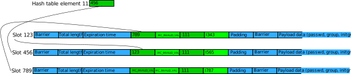

.. contents:: Table of Contents
    :local:

Memory Mapped Cache
===================

The memory mapped cache allows client applications to look up user and group
information very fast because the data will be mapped into the memory of the
application. As long as the data is in the cache and valid no additional
communication with other processes is needed.

This memory area is organized in 4 parts:

The Header
----------

At the beginning there is a header block which is defined in
``src/util/mmap_cache.h`` as:

.. code-block:: c

    struct sss_mc_header {
        uint32_t b1;            /* barrier 1 */
        uint32_t major_vno;     /* major version number */
        uint32_t minor_vno;     /* minor version number */
        uint32_t status;        /* database status */
        uint32_t seed;          /* random seed used to avoid collision attacks */
        uint32_t dt_size;       /* data table size */
        uint32_t ft_size;       /* free table size */
        uint32_t ht_size;       /* hash table size */
        rel_ptr_t data_table;   /* data table pointer relative to mmap base */
        rel_ptr_t free_table;   /* free table pointer relative to mmap base */
        rel_ptr_t hash_table;   /* hash table pointer relative to mmap base */
        rel_ptr_t reserved;     /* reserved for future changes */
        uint32_t b2;            /* barrier 2 */
    };

The ``major_vno`` and ``minor_vno`` are used to tell the client about how the
cache and the data is organized. With ``status`` SSSD can tell the client if the
cache is valid or if e.g. the cache is recycled. In the latter case the client
must close the current cache file and open a newly created.

``b1`` and ``b2`` are used to implement a full memory barrier with the help of
GCC's ``__sync_synchronize()`` built-in function. The memory barrier is used to
make sure the header data can be updated without other processes interfering.

``seed`` is a random seed for the hash function used to create lookup hashes
from the provided name or ID. It is generated randomly whenever the cache file
is created.

``dt_size``, ``ft_size`` and ``ht_size`` are the sizes of the remaining three
sections of the memory mapped cache and ``data_table``, ``free_table`` and
``hash_table`` are the starting points of the sections relative to the start of
the header.

The Data Table
--------------

This is the main area to store the user and group data. It is organized in slots
with a defined size. The current slot size is 40 bytes. Since the slot size is
not given in the header the ``major_vno`` or ``minor_vno`` must be changed if
the slot size is changed. Each data record for an individual user or group (see
below) can occupy one or more consecutive slots.

At startup the data table is initialized with ``0xff`` (all bits set) which is
treated as invalid value by the memory cache code independent if 1, 4 or 8 bytes
are read.

The Free Table
--------------

The memory area is treated as bit-field. Each bit corresponds to a slot in the
data table starting with the highest bit (``0x80``) of the first byte in the
free table.

At startup the free table is initialized with ``0x00`` (no bit set) which
corresponds to a completely empty data table.

The Hash Table
--------------

The hash table it treated as an array of ``uint32_t`` values. The index used to
access the array is the hash value calculated from the user or group name or ID
and the hash value is the slot number in the data table where the data record
for the object starts.

At startup the hash table is initialized with ``0xff`` which indicates that
there is no data available for the given hash.

Sizes of the tables
-------------------

From the previous sections it became clear that although the sizes of the data,
free and hash tables are handled independently they are connected. Of course the
free table should have at least so many bit as there are slots in the data
table. But having more would be a waste of space (although not as much as having
lesser bits). So number of bits and slots should match.

The size of the data table should be large enough to contain the expected
data (amount of data needed on the host running SSSD to work efficiently). It
should be large enough so that data in active use does not have to be
overwritten constantly with other data. So let's say there are *N* data elements
in the cache. Depending on the slot size and the type of data one slot might not
be sufficient to hold a data element of average size so there is a payload which
says how many slots are used typically for a data element. See below for a
discussion about the payload of the current data types. For the size of the data
table we now have *N* times the payload size.

With the number of data elements *N* we can now define the size of the hash
table as well. Since the data typically can be accessed either by name or ID we
need 2 times *N* entries in the hash table array for the ideal case where no
hash collisions occur. Since we always have to expect and handle hash collisions
it won't help to use more memory for the hash table. On the other hand hash
collisions should be avoided where possible because handling of the memory
caches becomes slower and more complex. Using less than 2 times *N* entries will
force hash collisions if the cache is filled with the expected number of
elements just using ``2 * N * sizeof(uint32_t)`` for the hash table size looks
like a good compromise.

How the data is organized
-------------------------

Currently there are three different kind of data elements

passwd
    User data defined by ``struct passwd``, see ``man getpwnam`` for details

group
    Group data defined by ``struct group``, see ``man getgrnam`` for details

initgroups
    Group memberships of user

All three types are stored in individual cache files. This allows a flexible
playload size and avoids hash collisions of different data types accessed with
the same name. Besides the type specific data all data elements start with a
common header.

The Record Header
^^^^^^^^^^^^^^^^^

Similar to the cache header, the record header is defined in
``src/util/mmap_cache.h`` as:

.. code-block:: c

    struct sss_mc_rec {
        uint32_t b1;            /* barrier 1 */
        uint32_t len;           /* total record length including record data */
        uint64_t expire;        /* record expiration time (cast to time_t) */
        rel_ptr_t next1;        /* ptr of next record rel to data_table */
                                /* next1 is related to hash1 */
        rel_ptr_t next2;        /* ptr of next record rel to data_table */
                                /* next2 is related to hash2 */
        uint32_t hash1;         /* val of first hash (usually name of record) */
        uint32_t hash2;         /* val of second hash (usually id of record) */
        uint32_t padding;       /* padding & reserved for future changes */
        uint32_t b2;            /* barrier 2 */
        char data[0];
    };

Similar as in the cache header ``b1`` and ``b2`` are used for memory barriers.
``len`` is the total length of the data record which includes the header size
and the type specific data which starts at ``data``. If the current time return
by ``time()`` is larger than the value stored in ``expire`` the data in the
memory cache should not be used anymore but SSSD's NSS responder should be
called to refresh the data.

``hash1`` and ``hash2`` are used to find the right starting slot of the data
record in the hash table. In theory they are not needed here but are used for a
fast and easy consistency check.

Finally ``next1`` and ``next2`` are used to handle hash collisions. Both value
are initialized with ``MC_INVALID_VAL``. If a hash collision is detected, i.e.
there is already a data record with the same hash stored in the cache the
``next1`` or ``next2`` elements are checked depending if the hash collisions was
found with ``hash1`` or ``hash2`` of the old record. If the related ``next[12]``
element is ``MC_INVALID_VAL`` the slot number of the new data record is added
here. If there is a different value stored in ``next[12]`` it is assumed to be
the slot number of another data record with the same hash. In this case the
chain is followed by reading the data record from the next slot until the
``next[12]`` element of the current data record is ``MC_INVALID_VAL``. Then the
slot number of the new data record is stored here.

The Passwd (User) Data
^^^^^^^^^^^^^^^^^^^^^^

The passwd/user data is defined in ``src/util/mmap_cache.h`` as:

.. code-block:: c

    struct sss_mc_pwd_data {
        rel_ptr_t name;         /* ptr to name string, rel. to struct base addr */
        uint32_t uid;
        uint32_t gid;
        uint32_t strs_len;      /* length of strs */
        char strs[0];           /* concatenation of all passwd strings, each
                                 * string is zero terminated ordered as follows:
                                 * name, passwd, gecos, dir, shell */
    };

The ``name`` pointer is a shortcut to the user name in the ``strs`` data and is
used to make sure that the object so far only found with the help of the hash
value does match the input name. If the user is search by ID the ``uid`` value
is used for this check. If there is no match there is either a hash collision
and the next entry in the chain has to be checked or the search entry is
currently not in the memory cache and the request has to be forwarded to SSSD's
nss responder.

The ``strs`` blob is expected to contain 5 0-terminated strings representing the
string components of ``struct passwd``, user name, password, gecos, home
directory and user shell. Since SSSD does not add password hashes to the output
the password string will typically be "*" or whatever the ``pwfield`` option
is set to.

A complete passwd/user record look like:

.. code-block:: hexdump

    0000000: 0000 00f0 7100 0000  ....q...
    0000008: 80f8 1f5a 0000 0000  ...Z....
    0000010: ffff ffff ffff ffff  ........
    0000018: 9c99 0000 2a35 0100  ....*5..
    0000020: ffff ffff 0000 00f0  ........

    0000028: 1000 0000 00d9 b92b  .......+
    0000030: 00d9 b92b 3900 0000  ...+9...
    0000038: 6164 6d69 6e40 6970  admin@ip
    0000040: 6166 3236 2e64 6576  af26.dev
    0000048: 656c 002a 0041 646d  el.*.Adm

    0000050: 696e 6973 7472 6174  inistrat
    0000058: 6f72 002f 686f 6d65  or./home
    0000060: 2f61 646d 696e 002f  /admin./
    0000068: 6269 6e2f 6261 7368  bin/bash
    0000070: 00ff ffff ffff ffff  ........

where each block represents one slot (40 bytes).

The total length ``len`` of this record is ``0x71`` (113) bytes. There are no
hash collisions as can be seen by the 0xff in the third line.

``struct sss_mc_pwd_data`` starts with the second block. The name string starts
after ``0x10`` (16) bytes. The uid and gid of the user are ``0x2bb9d900``
(733600000) and all strings together including the terminating ``0x00s`` are
``0x39`` (57) bytes long. The reminder of the last slot is filled with ``0xff``.

The Group Data
^^^^^^^^^^^^^^

The group data is defined in ``src/util/mmap_cache.h`` as:

.. code-block:: c

    struct sss_mc_grp_data {
        rel_ptr_t name;         /* ptr to name string, rel. to struct base addr */
        uint32_t gid;
        uint32_t members;       /* number of members in strs */
        uint32_t strs_len;      /* length of strs */
        char strs[0];           /* concatenation of all group strings, each
                                 * string is zero terminated ordered as follows:
                                 * name, passwd, member1, member2, ... */
    };

``name`` and ``gid`` are similar to the ones in ``struct sss_mc_pwd_data``.
``members`` is the number of members of the group. So it is expected to have
``members + 2`` (all members plus the group name and the group password)
0-terminated strings in the ``strs`` blob.

Here is an example for a group with 8 members:

.. code-block:: hexdump

    00000000: 0000 00f0 1201 0000  ........
    00000008: 2262 255a 0000 0000  "b%Z....
    00000010: ffff ffff ffff ffff  ........
    00000018: 87f8 0000 6184 0000  ....a...
    00000020: ffff ffff 0000 00f0  ........

    00000028: 1000 0000 2ad9 b92b  ....*..+
    00000030: 0800 0000 da00 0000  ........
    00000038: 7465 7374 5f67 726f  test_gro
    00000040: 7570 4069 7061 6632  up@ipaf2
    00000048: 362e 6465 7665 6c00  6.devel.

    00000050: 2a00 7465 7374 2d75  *.test-u
    00000058: 7365 7261 4069 7061  sera@ipa
    00000060: 6632 362e 6465 7665  f26.deve
    00000068: 6c00 7465 7374 2d75  l.test-u
    00000070: 7365 7262 4069 7061  serb@ipa

    00000078: 6632 362e 6465 7665  f26.deve
    00000080: 6c00 7465 7374 2d75  l.test-u
    00000088: 7365 7263 4069 7061  serc@ipa
    00000090: 6632 362e 6465 7665  f26.deve
    00000098: 6c00 7465 7374 2d75  l.test-u

    000000a0: 7365 7264 4069 7061  serd@ipa
    000000a8: 6632 362e 6465 7665  f26.deve
    000000b0: 6c00 7465 7374 2d75  l.test-u
    000000b8: 7365 7265 4069 7061  sere@ipa
    000000c0: 6632 362e 6465 7665  f26.deve

    000000c8: 6c00 7465 7374 2d75  l.test-u
    000000d0: 7365 7266 4069 7061  serf@ipa
    000000d8: 6632 362e 6465 7665  f26.deve
    000000e0: 6c00 7465 7374 2d75  l.test-u
    000000e8: 7365 7267 4069 7061  serg@ipa

    000000f0: 6632 362e 6465 7665  f26.deve
    000000f8: 6c00 7465 7374 2d75  l.test-u
    00000100: 7365 7268 4069 7061  serh@ipa
    00000108: 6632 362e 6465 7665  f26.deve
    00000110: 6c00 ffff ffff ffff  l.......

The full record is ``0x112`` (274) bytes long and occupies 7 slots. The ``struct
sss_mc_grp_data`` starts at the second slot, the name of the group can be found
``0x10`` (16) bytes later, the GID is ``0x2bb9d92a`` (733600042) and the groups
has 8 members. The ``strs`` blob is ``0xda`` (218) bytes long. Following the
group name and the group password ('*') the names of the 8 group members
``test-usera@ipaf26.devel, ..., test-userh@ipaf26.devel`` can be found.

The Initgr Data
^^^^^^^^^^^^^^^

Finally the initgr data is defined in ``src/util/mmap_cache.h`` as:

.. code-block:: c

    struct sss_mc_initgr_data {
        rel_ptr_t unique_name;  /* ptr to unique name string, rel. to struct base addr */
        rel_ptr_t name;         /* ptr to raw name string, rel. to struct base addr */
        rel_ptr_t strs;         /* ptr to concatenation of all strings */
        uint32_t strs_len;      /* length of strs */
        uint32_t data_len;      /* all initgroups data len */
        uint32_t num_groups;    /* number of groups */
        uint32_t gids[0];       /* array of all groups
                                 * string with name and unique_name is stored
                                 * after gids */
    };

Here we can see some differences to the previous two structs, there are two
names and two different kind of data areas. First we will look into the
data areas. The ``getgrouplist`` and similar other calls will return a list of
GIDs of groups the user is a member of. So the first part of the data blob
starting at ``gids`` is an array of ``uint32_t`` of size ``num_groups`` containing
the GIDs of the groups the user is a member of. After the GID list the two names
can be found as 0-terminated strings, first the string ``unique_name`` is
pointing to and then the string for ``name``. The length of both strings
including the terminating 0 byte is stored in ``strs_len`` and ``data_len``
stores the length of all data, GIDs and strings, so it is ``data_len = strs_len
* num_groups *sizeof(uint32_t)``.

The second name attribute was added to mitigate a general issue the memory
mapped cache currently has with lookup by names for initgr requests. A user can
only have a single UID and a group can only have a single GID. A different UID
would by definition automatically mean a different user from the point of view
of the Linux kernel. User and group names are basically labels to the UID or
GID, respectively, and multiple names can be assigned to a single UID or GID.
Traditionally there are ``struct passwd`` and ``struct group`` to map the UID or
GID with a single name and the ``getpwnam``, ``getpwuid``, ``getgrnam`` and
``getgrgid`` calls are used to find the ID for a name and vice versa. But there
is no restriction that the names used as first argument to ``getpwnam`` or
``getgrnam`` have to be the same as the ones returned as ``pw_name`` or
``gr_name`` in the related structs. ``pw_name`` and ``gr_name`` returned in
``struct passwd`` and ``struct group`` respectively can be considered as
canonical names. The names used as first argument for ``getpwnam`` and
``getgrnam``, as long as they differ from the canonical name, can be considered
as alias names.

Coming back to the memory mapped cache. The user and group data in the memory
cache only contain a single name, the canonical name. This means a user or group
entry can be only found in the memory mapped cache if the canonical name is used
to lookup the entry. There is not an issue with many Unix/Linux based use case
in general, but if the users are managed in Active Directory there might be
different expectations about the name format, see e.g. `MSDN: User Name
Formats`_. Besides the short *logon name* the fully-qualified *user principal
name (UPN)* or the old NT style *down-level logon name* can be used. What makes
it even worse is that names in AD are treated case-insensitive.

.. _MSDN\: User Name Formats: https://msdn.microsoft.com/de-de/library/windows/desktop/aa380525(v=vs.85).aspx

To allow lookups with different input names (aliases) one might be tempted to
just replace the canonical name in the memory cache record with the input name.
But this would fail if e.g. the related user is deleted on the server and has to
be deleted in the memory mapped cache as well. Now all entries must be checked
if they are somehow related to the deleted entry. To avoid this the canonical
name is added as well and its hash is written to the otherwise unused ``hash2``
element of ``struct sss_mc_rec``. Now Now different alias names can be used to
look up an object and after the first lookup will add an record with this name
to the cache. If there are changes on the server to the object all instances can
be found with the canonical name and handled accordingly.

Here is a example of what an initgr memory mapped cache record looks like:

.. code-block:: hexdump

    00000000: 0000 00f0 7300 0000  ....s...
    00000008: fff6 275a 0000 0000  ..'Z....
    00000010: ffff ffff ffff ffff  ........
    00000018: be4d 0100 049f 0000  .M......
    00000020: ffff ffff 0000 00f0  ........

    00000028: 2800 0000 4000 0000  (...@...
    00000030: 2800 0000 2300 0000  (...#...
    00000038: 3300 0000 0400 0000  3.......
    00000040: 2ad9 b92b 33d9 b92b  *..+3..+
    00000048: 34d9 b92b 35d9 b92b  4..+5..+

    00000050: 7465 7374 2d75 7365  test-use
    00000058: 7261 4069 7061 6632  ra@ipaf2
    00000060: 362e 6465 7665 6c00  6.devel.
    00000068: 7465 7374 2d75 7365  test-use
    00000070: 7261 00ff ffff ffff  ra......

As usual the first slot contains ``struct sss_mc_rec``. There are two different
hash values ``0x14dbe`` and ``0x9f04`` indicating that ``name`` and
``unique_name`` are different. ``struct sss_mc_initgr_data`` starts with the
second slot. The first two relative pointers give the start of ``unique_name``
and ``name``, respectively. Given that ``struct sss_mc_initgr_data`` starts at
``0x28`` (40) ``unique_name`` starts ``0x28`` (40) bytes later at ``0x50`` (80).
Similar ``name`` starts at ``0x40`` (64) after the start of the initgr data at
``0x68`` (104). Since the two names are the only strings used here ``strs`` is
``0x28`` (40) as well and the length ``strs_len`` of both strings is ``0x23``
(35) bytes. Together with the GIDs the total ``data_len`` is ``0x33`` (51)
bytes. This means 16 bytes more than the strings alone with is agreement to the
number of GIDs ``num_groups`` ``0x4`` (4). The GIDs of the groups are
``0x2bb9d92a`` (733600042), ``0x2bb9d933`` (733600051), ``0x2bb9d934``
(733600052) and ``0x2bb9d935`` (733600053).

How does a Client lookup an Entry?
----------------------------------

Depending on what data should be looked up the client has to open the related
cache file and map it into its own memory. To learn about the structure of the
cache the header must be read.

The Posix calls ``getpwnam``, ``getpwuid``, ``getgrnam``, ``getgrgid`` and
``getgrouplist`` either use a name or a POSIX ID as input. To find a matching
entry in the memory mapped cache the hash value must be calculated first. If a
name is used as input the hash is calculated from the name string including the
trailing 0-byte. If the lookup is by ID the numerical ID is converted into a
decimal string which is used with the trailing 0-byte to calculate the hash. The
seed for the hash function can be found in the header. In both cases the modulus
of the 32bit hash value and the size of the hash table array is calculated.

This value is now taken to lookup an entry in the hash table array. If it is
``MC_INVALID_VAL`` there is no matching entry in the cache and the request must
be forwarded to SSSD's NSS responder.

If the hash table entry contains another value it is assumed to be the starting
slot number of the related entry in the data table. After the entry is read
first the hashes (``hash1`` for name based and ``hash2`` for ID based lookups)
are compared with the input hash. If they match, the input value (name or ID) is
compared with the related data from the entry. If they match as well the data
from the entry is returned to the caller in the expected format. If one of the
comparisons fail, the next entry (if any) with the same hash value is lookup up
by reading the slot number stored in ``next1`` or ``next2`` depending if the
input hash matches ``hash1`` or ``hash2`` respectively.

If no matching entry was found the request must be forwarded to SSSD's NSS
responder.

How does the NSS Responder store an Entry?
------------------------------------------

First the NSS responder calculates the hash in the same way as the client and
checks if the entry already exists and is needed by following the chain of the
``next`` elements. If the entry already exists in the memory cache and
occupies the same number of slots as needed for the new data the old entry is
just overwritten with the new data.

When filling the memory cache the NSS responder keeps track of the next slot
which follows the last inserted entry. As long as a slot is free and the number
of remaining slots is larger than the number of needed slots for the new entry
the next free slot and the following free ones are used to store the entry and
the next slot is remembered again.

If the cache is already full, the free table is used to search to the needed
number of consecutive free slots. If none were found the next slot the entry is
pointing to is invalidated and if needed the following entries as well to make
room for the new entry.

This simple scheme becomes inefficient if the cache is full and more and more
new entries have to be added to the cache. In the worst case the full cache is
searched for empty slots every time before the new entry is added by overwritten
an existing entry. Additionally the lifetime of the cached entries is not taken
into account when overwriting existing entries.

After the new slots were found the entry is written to the memory mapped cached
protected by memory barriers. The starting slot number is either written to the
hash table or to the corresponding ``next`` element at the end of the chain of
entries with the same hash value.
