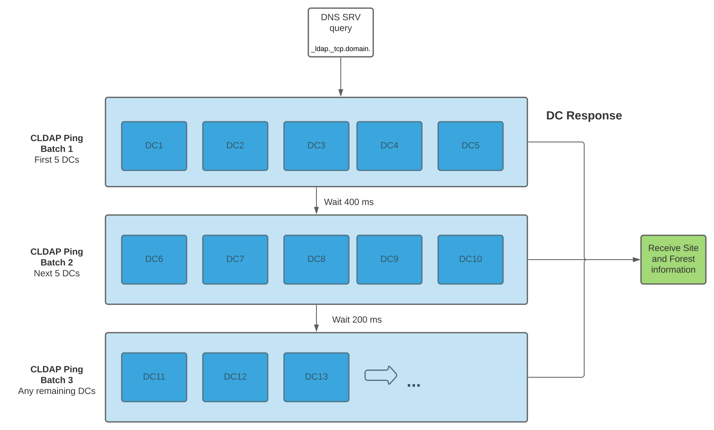

Service Discovery
#################

Active Directory Terms
======================

`Active Directory <https://en.wikipedia.org/wiki/Active_Directory>`_ is a directory service providing Windows and Linux clients with information about centrally stored user and group information. Below are some Active Directory terms that are important to understand for the purposes of this document.

Domain Controller
    The Active Directory Domain Controller (DC for short) is an important source of user information and authentication in many computing environments. The DC stores user and group information in an LDAP directory server (database) and provides this information as a `service <https://docs.microsoft.com/en-us/windows-server/identity/ad-ds/get-started/virtual-dc/active-directory-domain-services-overview>`_. This allows administrators to configure clients to retrieve user information from the AD DC. Similarly, the DC contains Kerberos data used to authenticate users password and access to other network services.

Domain
    A domain is defined as a logical group of network objects (computers, users, devices) that share the same Active Directory database.

Forest
    A forest is a collection of trees that share a common global catalog, directory schema, logical structure, and directory configuration. A forest contains one or multiple domains.

Site
    A logical organization, or container for objects within a domain. `Sites <https://docs.microsoft.com/en-us/windows-server/identity/ad-ds/plan/understanding-active-directory-site-topology>`_ are often used to group geographically-close systems together. Clients can prefer to communicate only to servers within a site.

When using the AD provider, by default SSSD clients utilize auto-discovery of Active Directory servers to avoid the need to explicitly define them in SSSD.conf on each client, and enable failover behavior. The term **Service Discovery** may also be used in SSSD documentation and manual pages to describe this. The goal is to discover Domain Controllers that will be used as primary and backup servers. Primary servers will always be tried first by SSSD, these are servers within a discovered, or given AD site. Backup servers will be used when primary servers are unavailable, these are servers within a domain, out of the client AD site.

LDAP/CLDAP ping
===============
`CLDAP (Connection-Less LDAP) ping  <https://ldapwiki.com/wiki/Wiki.jsp?page=LDAP%20ping>`_ is a way for clients to check the liveliness of a domain controller. Instead of LDAP where the communication is done over TCP protocol, the CLDAP ping is sent over UDP to be faster. It is often necessary for SSSD to try to find available domain controllers within a domain, or within an AD site. SSSD sends a LDAP ping during the service discovery phase by sending a `rootDSE <https://ldapwiki.com/wiki/Wiki.jsp?page=RootDSE>`_ search of the **netlogon** attribute. If available, the AD domain controller will return site, forest, and domain information in the **netlogon** response.

.. seealso::

    CLDAP ping behavior performed by Microsoft clients is described in `Microsoft protocol documentation <https://winprotocoldoc.blob.core.windows.net/productionwindowsarchives/WinArchive/%5bMS-DISO%5d.pdf>`_

SSSD stores the site information into the cache. If SSSD is restarted and a site name is in the cache, SSSD will attempt the CLDAP ping in the current site first.

Site-enabled discovery
======================
At domain initialization, if ``ad_enable_dns_sites`` is true (default) then the ``AD`` SRV lookup plugin is set. SSSD will attempt to discover primary (in-site) servers and backup servers using the following steps:

.. note::

    The ``ad_site`` option can be set manually in the SSSD configuration to speed up the discovery process.

#. **Set discovery domain**: read from ``dns_discovery_domain`` option or use ``ad_domain`` name
#. **Lookup AD site and forest** information using CLDAP ping

The below steps are used to perform a CLDAP ping to get site and forest information.
   * Find DCs to perform CLDAP ping against. The list of DCs to ping is the result of a `SRV query <https://en.wikipedia.org/wiki/SRV_record>`_ with the AD domain name and ldap service included the SRV lookup record query.
   * CLDAP ping is executed in 3 "batches" to avoid pinging too many domain controllers and avoid timeouts when attempting to ping unreachable AD DCs. If a response is received at any step then we skip the remaining steps.

     * Batch 1: CLDAP ping up to the first 5 domain controllers in the resolved server list
     * Wait 400ms for a response
     * Batch 2: CLDAP ping up to the next 5 domain controllers
     * Wait 200ms for a response
     * Batch 3: CLDAP ping any remaining domain controllers

#. **Discover primary and backup servers**

   If a site was found above, discover **site-specific** servers to use as primary servers, backup servers will be any servers discovered in the domain (not in the site)

   * Primary servers will be the result of **site-specific** DNS SRV resolution for dns discovery domain and 'ldap' service
   * Backup servers will be the result of DNS SRV resolution for dns discovery domain and the 'ldap' service

   If no site was found above

   * Primary servers will be the result of DNS SRV resolution for dns discovery domain and the 'ldap' service

#. **Sort Resulting Server list by DNS**

   * Prioritize servers with the same domain as the client, when priority is shared among server list result

#. Once this sequence of operations are done, SSSD saves

   * a sorted list of primary servers
   * a sorted list of backup servers, if applicable
   * a resolved DNS discovery domain
   * a DNS reply TTL
